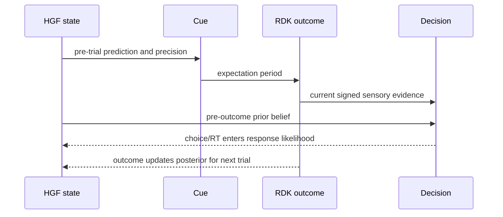
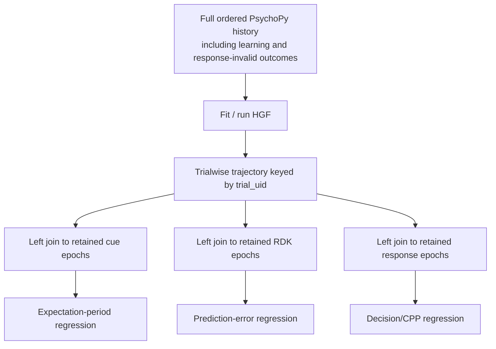

# HGF research ecosystem and BIDSEEG repository integration plan

**Research status:** 2026-07-22\
**Companion theory primer:**
[Hierarchical Gaussian Filters: theory, research, software, and a BIDSEEG integration plan](HGF_RESEARCH_AND_INTEGRATION.md)\
**Implementation status:** feasibility and architecture review only; no HGF
model has been fitted and no HGF result is claimed

This document continues the beginner-first theory primer with the software
review, research map, repository audit, proposed scientific models, engineering
contracts, and validation gates.

## 1. Estimation, validation, and reasons to be cautious

### 1.1 How HGF parameters are estimated

Traditional TAPAS HGF workflows often estimate a participant's parameters by
maximum a posteriori optimization:

# $$ \log p(\vartheta\mid y,u)

\log p(y\mid u,\vartheta) + \log p(\vartheta) +C. $$

Here $u$ is the input sequence, $y$ is the behavioral response, and $\vartheta$
includes perceptual and response parameters. Parameters are transformed to
permitted ranges, regularized by priors, and optimized. A Laplace approximation
may then estimate uncertainty and approximate model evidence.

PyHGF's JAX computations can instead be embedded in PyMC, permitting
hierarchical priors, HMC/NUTS sampling, posterior predictive checks, and ArviZ
model comparison. Full Bayesian inference is not automatically safe: the
official parameter-recovery tutorial demonstrates divergences and an $\hat R$
warning in a challenging example. Diagnostics are part of the result, not
housekeeping to hide.

### 1.2 Parameter recovery and model recovery are different

**Parameter recovery** asks: if known parameters generate synthetic behavior
using this exact task design, does the fitting procedure estimate them again?

**Model recovery** asks: if model A generates data, does a comparison among A,
B, C, and D correctly identify A?

A model may predict well while individual parameters remain inseparable. A
parameter may be recoverable when the true model is assumed, while model
comparison still confuses two families.

A valid workflow should:

1. simulate the exact number, order, conditions, and contingencies of this
   experiment;
2. draw parameters from plausible priors;
3. generate choices and, if modeled, response times;
4. refit every candidate model without using the generating labels;
5. report true-versus-estimated plots, bias, coverage, and failure rate;
6. report a model-confusion matrix;
7. perform prior and posterior predictive checks;
8. compare forward/blocked held-out prediction, LOO, or another justified
   criterion;
9. test sensitivity to priors, initial beliefs, reset rules, and update variant;
10. inspect correlation/VIF structure among proposed EEG regressors.

The practical guide by [Hess et al. (2025)](https://doi.org/10.5334/cpsy.116)
shows why response-time information can improve recovery in some designs, while
meta-volatility may remain difficult.
[Wilson and Collins (2019)](https://elifesciences.org/articles/49547) explain
why simulation and recovery belong before cognitive interpretation.

### 1.3 Structural and practical identifiability

- **Structural identifiability** is mathematical. Shifting or rescaling a hidden
  coordinate can sometimes be offset by changing its initial mean, coupling, or
  tonic volatility. Classic configurations therefore fix or strongly constrain
  some combinations of $\mu_i^0$, $\kappa_i$, and $\omega_i$.
- **Practical identifiability** depends on data. A parameter can be identifiable
  in theory but poorly recovered from 160 stable trials, noisy binary choices,
  or a response model that barely exposes it.

The hBayesDM
[HGF recovery tutorial](https://ccs-lab.github.io/hBayesDM/articles/hgf_tutorial.html)
is a useful warning: lower-level volatility and response sensitivity recover
well in its example, while its higher-level volatility parameter recovers
extremely poorly.
[Bröker et al. (2018)](https://doi.org/10.1371/journal.pone.0205974) likewise
found poor meta-volatility recovery in their task. These do not determine the
outcome here; they establish why this exact design needs its own recovery study.

### 1.4 Core limitations

1. **Local Gaussian approximation.** Multimodal or strongly skewed hidden
   beliefs can be represented badly.
2. **Quadratic/variational approximation.** Strong nonlinearities and large
   errors can strain the update.
3. **Simplified posterior dependencies.** Mean-field assumptions can discard
   coupling uncertainty.
4. **Invalid precision pathology.** Some classic volatility updates can produce
   negative/invalid posterior precision in parts of parameter space.
5. **Volatility–stochasticity confounding.** An unexpected trial may be stable
   risk, sensory error, or a changed world.
6. **Continuous-drift assumption.** Abrupt context switches may favor a hidden
   Markov or change-point model.
7. **Response-model dependence.** Changing how beliefs map to behavior can
   change perceptual estimates.
8. **Prior sensitivity.** Weak data can leave posteriors dominated by initial
   states or parameter priors.
9. **Latent-regressor collinearity.** Probability, surprise, prediction error,
   precision-weighted error, and trial type may be nearly redundant.
10. **Two-stage uncertainty loss.** Treating posterior-mean HGF trajectories as
    fixed EEG/HSSM regressors makes intervals too confident.

[Piray and Daw (2020)](https://doi.org/10.1371/journal.pcbi.1007963) give an
important approximation stress test and introduce the Volatile Kalman Filter.
Some classic HGF runs in their simulations developed invalid posterior variance,
and the VKF tracked a particle-filter reference more closely. This does not
prove that every HGF is inferior. It does mean numerical stability and serious
alternatives must be tested in the intended regime. Their work on
[joint inference about stochasticity and volatility](https://doi.org/10.1038/s41467-021-26731-9)
is especially relevant to probabilistic cue validity.

### 1.5 What a winning HGF would and would not prove

Better held-out behavior than credible alternatives would support the HGF as a
useful account of these data. It would not, by itself, prove that:

- the brain literally implements the published variational equations;
- an EEG component uniquely represents one HGF variable;
- precision-weighting is the only explanation of a neural association;
- a particular neurotransmitter implements that quantity;
- fitted volatility is a stable clinical trait;
- the model is universally “Bayes-optimal.”

Bayes-optimality is conditional on the assumed generative model and
approximation.

## 2. Current software ecosystem

### 2.1 PyHGF: the natural Python prototype

Primary resources:

- [PyHGF GitHub repository](https://github.com/ComputationalPsychiatry/pyhgf)
- [documentation home](https://computationalpsychiatry.github.io/pyhgf/)
- [theory notebook](https://computationalpsychiatry.github.io/pyhgf/notebooks/0.1-Theory.html)
- [creating networks](https://computationalpsychiatry.github.io/pyhgf/notebooks/0.2-Creating_networks.html)
  — supplied in the request
- [tutorial index](https://computationalpsychiatry.github.io/pyhgf/learn.html)
- [API reference](https://computationalpsychiatry.github.io/pyhgf/api.html)
- [peer-reviewed PyHGF paper](https://doi.org/10.1371/journal.pcbi.1014340)
- [PyPI metadata](https://pypi.org/project/pyhgf/)

As checked on 2026-07-22, the latest stable release is
[PyHGF 0.3.0](https://github.com/ComputationalPsychiatry/pyhgf/releases/tag/v0.3.0),
released 2026-06-16. Version 0.3 is a breaking release. It centers the `Network`
API, includes newer/unbounded volatility behavior as the default, aligns more of
the generalized/enhanced architecture, and deprecates older `HGF` or
distribution-oriented patterns. Tutorial prose and released API can drift; use
documentation for the pinned release and record non-default update settings.

A minimal fixed-parameter network currently looks conceptually like this:

```python
from pyhgf.model import Network

hgf = (
    Network()
    .add_nodes(kind="binary-state")
    .add_nodes(kind="continuous-state", value_children=0)
    .add_nodes(kind="continuous-state", volatility_children=1)
)

hgf.input_data(input_data=observations)
trialwise = hgf.to_pandas()
```

This creates a binary observation node, a continuous tendency node that predicts
it, and a volatility parent. `input_data` propagates fixed parameters through
the sequence. It does **not** infer participant-specific learning. Fitting
requires a response likelihood and optimization or probabilistic inference.

PyHGF's main strengths are:

- JAX-compatible differentiable updates;
- compositional graphs rather than one hard-coded chain;
- binary, continuous, categorical, constant, volatile, exponential-family, and
  Dirichlet-process-oriented nodes;
- value and volatility coupling;
- multiple parents and children;
- PyMC integration for multilevel models;
- direct trialwise trajectory export.

Some categorical, deep-network, and exponential-family functionality is
described as work in progress. Verify it in the pinned release before making it
essential to the study. Network plotting may require the Graphviz `dot`
executable as well as a Python package.

Useful tutorials:

- [custom response functions](https://computationalpsychiatry.github.io/pyhgf/notebooks/2-Using_custom_response_functions.html);
- [multilevel HGF](https://computationalpsychiatry.github.io/pyhgf/notebooks/3-Multilevel_HGF.html);
- [parameter recovery](https://computationalpsychiatry.github.io/pyhgf/notebooks/4-Parameter_recovery.html);
- [nonlinear value coupling](https://computationalpsychiatry.github.io/pyhgf/notebooks/5-Non_linear_value_coupling.html).

### 2.2 Environment and license caveats

The repository's working `mne-env` uses Python 3.10. PyPI metadata for PyHGF
0.3.0 requires Python 3.12 and newer NumPy/PyMC dependencies, while
repository-source metadata has not always matched release metadata. Installing
it directly into the existing EEG/HSSM environment risks destabilizing MNE, JAX,
PyMC, and HSSM.

Start with a separate pinned Python 3.12 environment and a TSV/Parquet boundary:

```powershell
py -3.12 -m venv .venv-hgf
.venv-hgf\Scripts\python -m pip install --upgrade pip
.venv-hgf\Scripts\python -m pip install "pyhgf==0.3.0"
```

These are proposed setup commands, not commands already run here. A committed
lockfile or fully pinned conda environment should replace this loose example
before analysis.

There is also a license-metadata inconsistency: the repository `LICENSE`/GitHub
classification reports MIT, while `pyproject.toml` and PyPI report GPL-3.0. Ask
the maintainers to clarify before vendoring or redistribution. Importing a
dependency for internal scientific analysis is a different issue from copying
its code into this repository.

### 2.3 Other implementations

| Package                                                                                                         | Best use                       | Strengths                                                 | Main caution                                               |
| --------------------------------------------------------------------------------------------------------------- | ------------------------------ | --------------------------------------------------------- | ---------------------------------------------------------- |
| [Standalone MATLAB HGF Toolbox](https://github.com/ComputationalPsychiatry/hgf-toolbox)                         | Established TAPAS-style work   | Large model catalog, simulation, diagnostics, MAP fitting | MATLAB dependency; map parameters explicitly               |
| [Archived TAPAS monorepo](https://github.com/translationalneuromodeling/tapas)                                  | Reproducing older papers       | Historical source for much HGF literature                 | Archived in 2025; use the standalone toolbox for new work  |
| [HierarchicalGaussianFiltering.jl](https://github.com/ComputationalPsychiatry/HierarchicalGaussianFiltering.jl) | Julia-native custom work       | Flexible nodes and ActionModels.jl integration            | Additional runtime; portions of docs say they are outdated |
| [hBayesDM](https://github.com/CCS-Lab/hBayesDM)                                                                 | Turnkey group models in R/Stan | Hierarchical shrinkage and familiar task interface        | Narrower HGF support, mainly binary input/response         |

The TAPAS ecosystem is reviewed by
[Frässle et al. (2021)](https://doi.org/10.3389/fpsyt.2021.680811). PyHGF is the
natural prototype for Python/MNE; the standalone MATLAB toolbox is a useful
cross-implementation reference.

### 2.4 Predictive accumulation resources

- [Predictive evidence accumulation preprint](https://arxiv.org/abs/2411.13203)
- [MATLAB PAM repository](https://github.com/antovis86/PAM-PredictiveAccumulationModels)
- [Python PAM repository](https://github.com/francesco-cal98/Pam---Predictive-Accumulator-models)
- [R/Stan PAM repository](https://github.com/Mar-Cald/PAM-PredictiveAccumulationModels)

PAM is the closest published computational idea to using HGF/VKF learning inside
this repository's DDM. It should inform the model specification. The visible
codebases vary in completeness and release maturity, so any borrowed
implementation still needs independent simulation tests.

## 3. Research map

### 3.1 Foundations and methods

| Source                                                                                 | Contribution                                                                        |
| -------------------------------------------------------------------------------------- | ----------------------------------------------------------------------------------- |
| [Mathys et al. 2011](https://doi.org/10.3389/fnhum.2011.00039)                         | Original variational Bayesian foundation for individual learning under uncertainty. |
| [Mathys et al. 2014](https://doi.org/10.3389/fnhum.2014.00825)                         | Expanded framework, uncertainty taxonomy, response models, and identifiability.     |
| [Frässle et al. 2021](https://doi.org/10.3389/fpsyt.2021.680811)                       | TAPAS computational-psychiatry ecosystem.                                           |
| [Piray and Daw 2020](https://doi.org/10.1371/journal.pcbi.1007963)                     | VKF and important approximation/numerical critique of classic HGF.                  |
| [Piray and Daw 2021](https://doi.org/10.1038/s41467-021-26731-9)                       | Joint learning about stochasticity and volatility.                                  |
| [Hess et al. 2025](https://doi.org/10.5334/cpsy.116)                                   | Bayesian workflow and recovery considerations for learning models.                  |
| [Weber et al., generalized HGF](https://elifesciences.org/reviewed-preprints/110174v1) | Value coupling and compositional networks, with public assessment and reviews.      |
| [Legrand et al. 2026, PyHGF](https://doi.org/10.1371/journal.pcbi.1014340)             | Peer-reviewed JAX/Rust/PyMC software and network framework.                         |
| [Robust volatility updates, 2026 preprint](https://arxiv.org/abs/2605.00966)           | Update approximation designed for positive precision and large-error robustness.    |

### 3.2 Influential neuroscience applications

| Source                                                                 | What it illustrates                                                      |
| ---------------------------------------------------------------------- | ------------------------------------------------------------------------ |
| [Iglesias et al. 2013](https://doi.org/10.1016/j.neuron.2013.09.009)   | Hierarchical prediction errors in sensory learning and model-based fMRI. |
| [Diaconescu et al. 2014](https://doi.org/10.1371/journal.pcbi.1003810) | Inference about social advice, intentions, and volatility.               |
| [Diaconescu et al. 2016](https://doi.org/10.3389/fncom.2016.00033)     | HGF and change-point accounts compared.                                  |
| [Lawson et al. 2017](https://doi.org/10.1038/nn.4615)                  | Volatility learning in autistic adults.                                  |
| [Powers et al. 2017](https://doi.org/10.1126/science.aan3458)          | Prior weighting and conditioned hallucinations.                          |

These establish scientific uses, not universal validation. Tasks, response
models, priors, software, and objectives differ, so their numerical parameter
estimates are not transferable priors without justification.

### 3.3 Especially relevant EEG applications

| Source                                                                                    | Lesson for this repository                                                |
| ----------------------------------------------------------------------------------------- | ------------------------------------------------------------------------- |
| [Stefanics et al. 2018](https://doi.org/10.1523/JNEUROSCI.3365-17.2018)                   | Single-trial visual mismatch responses and HGF precision-weighted errors. |
| [Weber et al. 2020](https://doi.org/10.1523/JNEUROSCI.3069-19.2020)                       | Multivariate HGF analysis of auditory regularities and ketamine effects.  |
| [Liu et al. 2022](https://doi.org/10.1093/cercor/bhab245)                                 | Low/high-level learning signals related to P300 and theta.                |
| [Clinical-high-risk psychosis study](https://doi.org/10.1038/s41537-022-00302-3)          | Trialwise low/high-level errors related to auditory ERPs.                 |
| [Hierarchical errors and precisions in oddball EEG](https://doi.org/10.1162/imag_a_00461) | Recent localization of hierarchical computational quantities.             |

The reusable method is model-based single-trial analysis. Electrodes, windows,
and components from another paradigm should not be copied without independent
justification.

### 3.4 Recommended reading order

1. Mathys 2014 for the full framework.
2. Mathys 2011 for the derivational origin.
3. Iglesias 2013 for a canonical neuroscience application.
4. Stefanics 2018 and Weber 2020 for EEG examples.
5. Piray and Daw 2020/2021 for approximation and uncertainty cautions.
6. Wilson and Collins 2019 plus Hess 2025 for validation discipline.
7. The generalized-HGF reviewed preprint and public reviews.
8. The PyHGF paper, network, response-model, and recovery tutorials.
9. The robust-volatility preprint for the newest technical direction.

## 4. What this experiment actually contains

The task description in
[ExperimentGuide_HierarchicalPriors.md](ExperimentGuide_HierarchicalPriors.md)
shows a 500 ms cue, an approximately 1,000 ms fixation, then random-dot motion.
Cue triggers are `S1/S2/S4`; motion triggers are `S8/S16`; response triggers
distinguish correct and incorrect responses. PsychoPy logs, not BIDS events
alone, provide reaction time, coherence, prior mapping, block condition, and
other HGF-critical metadata.

Relevant canonical columns are prepared by `behavdata_prep()` in
[d_BehavAnalysis_module.py](d_BehavAnalysis_module.py):

- `participant`: grouping;
- `exp`: baseline, low-level, or high-level condition;
- `block_cond`: baseline, learning, or test;
- `block_order`: condition order/counterbalancing information;
- `thisN`: trial within a small block, **not a global trial number**;
- `cueAss`, `cueHz`: cue mapping and identity;
- `motion_direction`: physical outcome;
- `prior`: normalized predicted direction;
- `response`: observed choice;
- `corr`, `rt`, `rt_flag`: response information and validity;
- `coh`, `coh_level`: sensory evidence strength;
- `response_prior`: a derived response code whose semantics vary by condition.

### 4.1 Audited sample facts

| Data source                           | Audited content                                                                      | What it supports                                                  |
| ------------------------------------- | ------------------------------------------------------------------------------------ | ----------------------------------------------------------------- |
| Full OpenNeuro behavioral derivatives | 43 usable CSVs, about 20,620 rows, only `base` and `test`, zero `learn` rows         | Test-period sequence analyses; not full acquisition               |
| Current `EEG_iaf.csv`                 | 18,795 rows from 42 EEG participants                                                 | Trialwise EEG join only after stable identity is repaired         |
| Raw demo PsychoPy logs                | Three subjects; include learning blocks                                              | Loader development, sequence reconstruction, and smoke tests only |
| Demo subject 001                      | Low learn 60, low test 160, high learn 80, high test 160; baseline approximately 160 | Demonstrates intended acquisition-to-test transitions             |

Across all 43 processed test tables, audited physical prior congruence is
approximately:

- **low-level:** 74.94%;
- **high-level:** 50.06%;
- **baseline leftward-motion rate:** 50.01%.

In demo subject 001, low-level learning and test are both 75% congruent;
high-level learning is 75% congruent and high-level test is about 52.5%.

These facts change the scientific interpretation:

- Low-level trials form a genuine approximately 75% probabilistic cue–outcome
  stream.
- High-level test trials are approximately uninformative physical evidence
  following reinforced/instructed prior learning. This is a possible **belief
  persistence under disconfirming evidence** experiment, not merely another 75%
  HGF.
- Baseline has no equivalent predictive cue and should not be silently fed into
  the same prior-congruence model.

### 4.2 The missing acquisition history is a hard evidence boundary

The current configuration analyzes only `base` and `test`. `behavdata_prep()`
filters out learning rows before writing the full processed tables. A test-only
high-level filter could be initialized to 75%, but that initial belief would be
an analyst assumption rather than a state inferred from the participant's
complete experience.

Full-sample claims about any of these require recovering raw learning logs:

- acquisition rate;
- participant-specific belief at the start of test;
- learning-to-test transition;
- whether high-level beliefs persist more strongly than low-level beliefs;
- participant-specific volatility across the transition.

If raw acquisition remains unavailable, every output must be labeled
`test_only`, initial-belief sensitivity must be reported, and the claim must
stay at “conditional test-period trajectory.”

### 4.3 There is currently no stable trial key

`thisN` restarts from 0 to 19 within blocks. The previously used key
`(participant, block_cond, block_order, thisN)` is therefore non-unique. In the
18,795-row EEG IAF derivative it yields only 1,720 unique combinations. Earlier
documentation already records a many-to-many merge explosion.

Create identity at the earliest ordered source boundary:

- `trial_seq`: monotonically increasing trial number within
  participant/session/source file;
- `trial_uid`: deterministic participant + session + source identity +
  `trial_seq`;
- retain raw `block_idx` when present;
- if block index must be derived, do so before any filtering and mark it as
  derived.

Every behavioral input, HGF trajectory, HSSM table, and EEG metadata row must
carry `trial_uid`. No HGF integration should proceed until one-to-one uniqueness
tests pass.

### 4.4 Filtering response rows is not filtering experience

The behavioral module flags/removes implausible or missing RTs before current
DDM/HSSM analyses. That is appropriate for a response likelihood. It is wrong
for HGF state evolution if the participant still saw the cue and motion outcome.

Use two masks:

- `state_update_valid`: was the relevant environmental observation presented?
- `response_likelihood_valid`: is choice/RT usable for fitting the response
  model?

A missing response can be masked from the likelihood while its observed motion
outcome still updates the latent belief state. Likewise, EEG rejection must
never delete a trial from the fitted behavioral history.

### 4.5 Source discovery needs hardening

The existing loader uses the first CSV whose filename contains the subject ID.
The full directory can contain a real behavioral CSV and a small git-annex
pointer with a similar name. A new loader should:

- validate the required schema and plausible row count;
- reject pointer files explicitly;
- fail on multiple valid matches instead of relying on enumeration order;
- record source filename and checksum in a manifest.

## 5. Recommended scientific models

### 5.1 Start with a model ladder, not a single favorite

| ID | Model                                   | Purpose                                                               |
| -- | --------------------------------------- | --------------------------------------------------------------------- |
| M0 | Static base-rate/instructed-prior model | Checks whether trialwise learning is needed at all                    |
| M1 | Rescorla-Wagner / fixed learning rate   | Simple adaptive baseline                                              |
| M2 | Two-level binary HGF                    | Adaptive Bayesian tracking without freely interpreted meta-volatility |
| M3 | Three-level binary HGF                  | Adds inferred volatility, retained only if recoverable                |
| M4 | Volatile Kalman Filter                  | Serious simpler volatility comparator                                 |
| M5 | Change-point or HMM model               | Tests whether abrupt context/regime inference fits better             |
| M6 | HGF/VKF + evidence accumulator          | Joint across-trial learning and within-trial choice/RT mechanism      |

Do not move to a generalized multi-parent network merely because software makes
it possible. Add a node or coupling only when the experimental manipulation and
recovery results identify it.

### 5.2 Highest-priority input: low-level cue validity

For prior trials, define the environmental outcome

$$
u_t=\mathbb 1(\text{motion direction}_t=\text{prior direction}_t).
$$

Thus 1 means the cue prediction was physically confirmed and 0 means it was
violated. A corresponding behavioral response is

$$
y_t=\mathbb 1(\text{choice}_t=\text{prior direction}_t).
$$

Coherence and signed motion direction provide current sensory evidence.

Two defensible network forms are:

1. one prior-relative congruency HGF, assuming both tones share reliability;
2. two cue-specific binary state nodes sharing a volatility parent, allowing
   asymmetric cue learning.

The shared model is simpler and should be primary. The cue-specific version is a
robustness analysis if enough trials remain.

### 5.3 Choice timing requires a custom response model

The participant sees the current motion before responding. The response on trial
$t$ should therefore depend on:

- the HGF's **pre-outcome** prediction about cue validity;
- the direction and coherence of the current RDK;
- response bias/noise and possibly a within-trial accumulation process.

It must not use the HGF posterior after incorporating $u_t$ as if that posterior
existed before the same choice. A correct causal ordering is:



In code, test leakage directly: changing only $u_t$ must not alter the `*_pre`
predictor used for choice or cue-period EEG on trial $t$.

### 5.4 High-level instructed-prior persistence

High-level acquisition in the demo is 75% prior-congruent, followed by
approximately 50/50 physical test evidence. A plain outcome-driven HGF will
gradually learn that the glasses/context are nonpredictive. That is useful if
the question is explicitly whether and how behavior departs from this
evidence-driven update.

Candidate high-level models are:

- informed initial state followed by ordinary HGF updating;
- condition-specific learning or volatility parameters;
- a fixed instructed-belief model;
- a generalized network with an exogenous instruction/context parent that
  sustains the prior;
- comparison with Rescorla-Wagner, two-level HGF, three-level HGF, VKF, and
  change-point accounts.

Do not treat the neutral `cueHz == 750` high-level cue as if it were one of the
learned low-level tones. The high-level manipulation is semantic/contextual, not
a second physical tone contingency.

### 5.5 Baseline response semantics must be repaired

In prior conditions, `response_prior` means prior-congruent versus incongruent
choice. In baseline, it is coded as left versus right. Pooling these values as
one binary outcome silently changes the upper decision boundary across
conditions.

A cleaner long-term coding is:

- `choice_right = 1` for a right response in every condition;
- `motion_signed` or `coherence_signed` for physical sensory evidence;
- `prior_right_logodds_pre`, negative for a leftward expectation and positive
  for rightward;
- explicit interactions with `exp` where the prior manipulation differs.

Baseline then becomes a meaningful no-informative-prior comparator instead of a
differently labeled response.

## 6. HGF plus the existing HSSM/DDM

The current HSSM models participant/group hierarchy and within-trial evidence
accumulation. HGF adds across-trial learning states. They are complementary.

Candidate comparisons include:

- HGF belief affects DDM starting point `z` only;
- HGF belief affects drift `v` only;
- belief affects `z`, while belief precision interacts with coherence in `v`;
- the current categorical `exp` model remains the baseline.

Conceptually:

```text
z ~ 1 + prior_right_logodds_pre * exp + (1|participant)
v ~ 1 + exp * coherence_signed + hgf_precision_pre:coh_wc + (1|participant)
```

The existing categorical condition effect should not be removed automatically.
Compare whether dynamic belief terms improve held-out choice/RT prediction
beyond `exp`.

The current HSSM data-source selection checks whether the formula text contains
`alpha`. Do not add another substring special case for `hgf`. Replace it with an
explicit source/assembly contract such as:

```json
"data_source": "behavioral|eeg|hgf|eeg_hgf"
```

or build validated covariate tables via one-to-one `trial_uid` joins.

A two-stage HGF → HSSM pipeline treats estimated latents as known. This is
acceptable for exploration and engineering validation if labeled clearly.
Confirmatory inference should propagate posterior draws through the HSSM or
implement a joint likelihood, because plug-in means understate uncertainty.

## 7. EEG integration and causal timing

### 7.1 Fit the complete behavior, then join retained EEG



Never refit the HGF after EEG artifact rejection. Rejected trials still occurred
and changed the participant's subsequent experience.

### 7.2 Which regressor belongs to which event

| Event lock       | Valid HGF quantities                                                                              | Example neural questions                                                       |
| ---------------- | ------------------------------------------------------------------------------------------------- | ------------------------------------------------------------------------------ |
| Cue (`S1/S2/S4`) | pre-outcome predicted probability, log-odds, predicted precision/uncertainty, expected volatility | Does anticipatory alpha/aperiodic activity encode prior strength or precision? |
| RDK (`S8/S16`)   | outcome surprise, value PE, precision-weighted value PE, volatility PE, learning rate             | Do ERP/P300/theta/TFR responses encode hierarchical errors?                    |
| Response         | pre-outcome belief plus current evidence; decision variables; prior-trial posterior               | Does CPP slope/onset or motor preparation reflect learned prior bias?          |

The current cue-locked epoch is approximately `-0.6` to `+1.5` seconds and the
RDK starts around one second after the cue/fixation sequence. The existing
trial-alpha estimator uses a broad post-cue window that reaches or approaches
RDK onset. It is not a pure expectation-period measure.

Recommended changes when implementation begins:

- define a genuinely pre-RDK cue/expectation window, for example a justified
  portion within 0–0.8 s;
- create RDK-locked epochs from `S8/S16` for current-trial prediction errors;
- create response-locked epochs for accumulation/CPP questions if triggers and
  timing support them;
- attach predicted and posterior variables with unmistakable suffixes.

### 7.3 Statistical EEG design

Use single-trial regression, regression-based ERP/TFR, or mixed/mass-univariate
models rather than only median splits or condition averages. At group level:

- center or standardize within participant when the hypothesis is trialwise;
- preserve between-participant means separately if testing traits;
- predefine whether PE and precision-weighted PE appear in separate models;
- inspect VIF/correlation and do not use arbitrary orthogonalization to
  manufacture uniqueness;
- correct across time, electrodes, frequencies, and tested computational
  quantities;
- avoid circular channel/window selection;
- use cross-validated/held-out latent construction for decoding where leakage is
  possible.

The current full-sample results caution that trialwise instantaneous alpha
frequency is not a clearly reliable primary predictor. Alpha power, aperiodic
exponent/offset, ERP amplitude, theta, or CPP measures may be more stable
candidates, but that is a hypothesis requiring measurement-reliability checks.

## 8. Repository architecture

### 8.1 Extract a pure behavioral sequence layer

`behavdata_prep()` currently lives inside the large behavioral analysis module,
and the EEG artifact module imports it from there. A better boundary is a pure
`behavioral_data.py` module with no MNE dependency and no import-time
`inputs.json`/`sys.argv` side effect.

It should return two explicit views:

1. **Full chronological experience table**
   - includes learning, baseline, and test as available;
   - preserves outcomes with missing/flagged responses;
   - creates stable UID, sequence, and block fields;
   - records source provenance.
2. **Analysis-specific response table**
   - applies current block and RT rules for SDT/DDM/HSSM;
   - never changes the identity/order of the full table.

Consumers then become:

- EEG epoch construction: analysis view plus stable UID;
- behavioral SDT/DDM: response-valid view;
- HGF: full chronological view with response likelihood mask;
- HSSM/EEG regressions: HGF derivative joined by UID.

This mirrors the repository's existing good precedent of keeping
`frequency_sliding.py` pure and testable.

### 8.2 Proposed module order

If dynamic HGF states feed HSSM, the scientific order is:

```text
d behavioral preparation
→ e HGF state/response modeling
→ f HSSM with optional HGF covariates
```

One migration path is:

- add `e_HGF_module.py`;
- rename the present HSSM implementation to `f_HSSM_module.py`;
- keep `e_HSSM_module.py` as a temporary compatibility wrapper.

Alternatively, retain filenames but document the nonalphabetical dependency. The
first option is clearer but should be a deliberate compatibility change, not
mixed into an initial research prototype.

Do not send HGF DataFrames through `utils.save_preprocessing_step()`. That
function is a type-dispatched EEG artifact writer and intentionally errors for
unsupported types. HGF is not preprocessing stage `06`; it should not mutate
`basic.current_step` or create a fake processed EEG file.

### 8.3 Configuration proposal

This is library-agnostic. Exact parameter names must follow the pinned PyHGF
release.

```json
"perform": {
  "compute_hgf": false
},
"Analysis": {
  "hgf": {
    "implementation": "pyhgf",
    "implementation_version": "0.3.0",
    "model_family": "binary",
    "levels": 2,
    "conditions": ["lowlevel", "highlevel"],
    "state_update_blocks": ["learn", "test"],
    "evaluation_blocks": ["test"],
    "observation_encoding": "motion_prior_congruence",
    "response_encoding": "choice_prior_congruence",
    "sequence_reset": ["participant", "exp"],
    "cue_mode": "shared_reliability",
    "missing_response": "mask_likelihood_keep_outcome",
    "fit_scope": "hierarchical_group",
    "fit_method": "pymc_nuts",
    "volatility_updates": "record_explicitly",
    "initial_belief_sensitivity": [0.5, 0.75, 0.9],
    "random_seed": 1943,
    "save_trialwise": true
  }
}
```

Constraints:

- Do not change the shape of `Analysis.conditions`; modules assume the first key
  is the metadata split column.
- `inputs.json` is mutable runtime state, so copy the exact resolved HGF
  configuration into the result directory before running.
- Record `full_sequence` versus `test_only` in every manifest.
- Begin with a small free-parameter set; do not free every initial state,
  coupling, tonic volatility, meta-volatility, and response parameter per
  participant.

### 8.4 Output contract

Suggested layout:

```text
results/groupBehavioral/hgf/
  model_config.json
  input_manifest.tsv
  sub-XXX_ses-01_task-HierPrior_desc-hgf_input.tsv
  sub-XXX_ses-01_task-HierPrior_desc-hgf_trajectories.tsv
  sub-XXX_ses-01_task-HierPrior_desc-hgf_parameters.tsv
  sub-XXX_ses-01_task-HierPrior_desc-hgf_diagnostics.json
  hgf_group_parameters.tsv
  hgf_model_comparison.tsv
  hgf_fit_diagnostics.tsv
  inference_data.nc
  plots/
```

Every trajectory should include:

- `trial_uid`, participant/session/source, `trial_seq`, raw/derived block ID;
- `exp`, `block_cond`, cue identity, prior direction, motion direction,
  coherence;
- raw outcome encoding `u` and response encoding `y`;
- state-update, response-likelihood, and EEG-retained masks;
- `hgf_p_outcome_pre`, hidden mean/variance/precision before outcome;
- post-outcome hidden mean/variance/precision;
- raw and precision-weighted value PE;
- volatility PE, effective learning rate, surprise;
- trial log likelihood where defined;
- model name/version and sequence reset ID.

Also save exact input, configuration, fixed/free parameters, priors, update
flags, Python/PyHGF/JAX/PyMC versions, seed, repository commit, source
checksums, convergence diagnostics, and coverage status.

## 9. Phased implementation with go/no-go gates

### Phase 0 — Repair identity and data provenance

Work:

- create the pure behavioral loader;
- preserve chronological order, `block_idx`, learning rows, and missing-response
  outcomes;
- add `trial_seq`/`trial_uid` before filtering;
- reject pointer/ambiguous source files deterministically;
- inventory raw learning availability for all 43 behavioral participants.

Go gate:

- UID is unique in full behavior;
- all downstream subset joins are one-to-one;
- row-count/condition reports reconcile to source logs;
- every source has a checksum and explicit coverage label.

### Phase 1 — Fixed-parameter demo/ideal observer

Work:

- pin PyHGF in isolated environment;
- build M0, M1, M2, and M3 forward simulators;
- run only on the three raw demo subjects and synthetic schedules;
- export pre/post variables and test causal alignment.

Claims allowed:

- “These are fixed-parameter/normative trajectories for the presented schedule.”

Claims not allowed:

- participant-specific learning or individual differences.

Go gate:

- stable 75% sequences converge in the expected direction;
- reversals produce correctly signed errors and adaptation;
- no non-finite precision/probability;
- classic/unbounded variants are recorded and stress-tested;
- output length/order exactly matches input.

### Phase 2 — Behavioral fitting and recovery

Work:

- implement the causal response model using pre-outcome prior plus current
  sensory evidence;
- compare static, RW, two-level HGF, three-level HGF, VKF, and justified context
  models;
- fit hierarchically or with strong partial pooling;
- simulate and recover exact task schedules;
- perform posterior predictive and forward held-out checks.

Go gate:

- convergence standards are predefined and met;
- selected parameters recover with acceptable bias/coverage;
- model confusion is acceptable;
- HGF improves predictive performance over simple baselines;
- any level-3 interpretation passes its own recovery gate.

If meta-volatility does not recover, retain the two-level HGF and do not claim
individual volatility differences.

### Phase 3 — Scale with evidence labels

Work:

- run full acquisition + test when raw logs are recovered;
- otherwise run explicitly `test_only` sensitivity analyses;
- report missingness and exclusion without removing outcomes from state history.

Go gate:

- all participants pass identity/provenance checks;
- coverage label is visible in every table/plot;
- conclusions do not exceed available history.

### Phase 4 — HGF-informed HSSM

Work:

- compare `z`-only, `v`-only, both, and categorical-condition models;
- begin with posterior-mean exploratory regressors;
- add posterior-draw sensitivity or a joint model for confirmation.

Go gate:

- held-out choice/RT prediction improves;
- signs and timing match the generative specification;
- results are robust to HGF posterior uncertainty and model choice.

### Phase 5 — EEG analyses

Work:

- cue/pre-RDK regression for prediction and precision;
- RDK-locked regression for prediction errors and surprise;
- response-locked analyses for decision dynamics;
- prespecified multiplicity and reliability checks.

Go gate:

- UID joins are one-to-one;
- pre/post timing tests pass;
- latent collinearity is controlled by a declared design;
- neural conclusions survive plausible learning-model alternatives.

## 10. Test plan

### Fast unit tests

- Chronological order survives canonicalization.
- `trial_uid` remains unique when `thisN` resets.
- Cue counterbalancing yields invariant prior-relative coding.
- Baseline semantics cannot be silently mixed with prior-congruence coding.
- Missing responses stay in state updates but are masked from response
  likelihood.
- Learning rows remain available when requested.
- Network output length/order equals input.
- Predicted probabilities are finite and within `[0, 1]`.
- Changing $u_t$ does not change the pre-outcome predictor at $t$.
- A stable 75% synthetic stream raises predicted congruence.
- A reversal creates signed prediction errors and appropriate adaptation.
- A UID join to an EEG-retained subset is exactly one-to-one.
- Pointer and ambiguous behavioral sources fail deterministically.

### Model validation

- Parameter recovery on exact schedules.
- Model recovery/confusion for M0–M5.
- Forward/blocked validation, not random trial folds that leak future
  information.
- Posterior predictive calibration by condition and block.
- Sensitivity to initial belief, reset policy, update variant, and inclusion of
  learning.
- Numerical stress tests over planned prior support.

### Repository integration

- Environment/version smoke test in isolated HGF runtime.
- Cheap fixed-parameter HGF smoke test in ordinary CI.
- Expensive fitting marked separately as slow/model validation.
- Provenance schema and UID uniqueness test before any pipeline model step.

Documentation-only work in this research pass does not require running the EEG
pipeline or claim that its code tests pass.

## 11. Risk register

| Risk                                | Consequence                                 | Mitigation                                                 |
| ----------------------------------- | ------------------------------------------- | ---------------------------------------------------------- |
| Full-sample learning rows missing   | Acquisition/transition cannot be inferred   | Recover raw logs or label analyses `test_only`             |
| No stable trial key                 | Many-to-many joins and wrong latents on EEG | Create UID at raw ordered source; assert uniqueness        |
| RT/EEG filtering removes experience | Distorted subsequent beliefs                | Separate state-update and likelihood/EEG masks             |
| Same-trial posterior leakage        | Circular choice/EEG prediction              | Use pre-outcome variables and explicit leakage tests       |
| Stationary low-level schedule       | Level-3 volatility may be unidentifiable    | Compare two-level model; require recovery                  |
| High-level instruction omitted      | Misspecified evidence-driven learner        | Model context/instruction and compare fixed-belief account |
| Baseline coding changes meaning     | Invalid pooled response boundary            | Use physical right/left coding and signed priors           |
| Volatility confused with risk/noise | Overinterpreted latent state                | Include sensory evidence and stochasticity alternatives    |
| PyHGF dependency conflict           | Breaks MNE/HSSM environment                 | Isolated pinned Python 3.12 runtime                        |
| PyHGF update/API drift              | Irreproducible trajectories                 | Pin version/commit and record update flags                 |
| License metadata mismatch           | Redistribution uncertainty                  | Clarify with maintainers before vendoring                  |
| Too many free parameters            | Unstable or prior-driven estimates          | Strong pooling, small model, recovery first                |
| Two-stage plug-in                   | Underestimated uncertainty                  | Posterior-draw sensitivity or joint likelihood             |
| Latent EEG collinearity             | Nonunique neural interpretation             | Separate prespecified models and report correlations       |
| Trait × parameter fishing           | False positives                             | Preregister a small set and correct multiplicity           |
| Mutable `inputs.json` state         | Provenance tied to last subject/step        | Snapshot resolved config in HGF outputs                    |

## 12. Concrete recommendation

The best first real model is a **two-level binary HGF of low-level cue
validity**, using the complete ordered learning + test outcome stream, fit with
a custom choice model that combines the pre-RDK predicted cue direction with
signed current motion coherence. Compare it against a static 75% model,
Rescorla-Wagner, and VKF.

Only then test a three-level HGF. Retain its volatility parameters only if
exact-design simulations recover them and held-out behavior improves.

Treat the high-level condition as a separate model-comparison question about
instructed belief persistence under approximately 50/50 test evidence. The
generalized HGF's value/context coupling is conceptually attractive there, but
it should enter only after simpler fixed-instruction and standard learning
accounts are beaten.

Finally, export pre-outcome belief/precision to cue-period EEG and post-outcome
errors to newly RDK-locked EEG. Use HGF states in the HSSM first as a
transparent two-stage exploratory analysis; propagate posterior uncertainty
before making confirmatory mechanistic claims.

That sequence gives HGF a fair test while protecting the project from the two
most common mistakes: fitting an elaborate volatility model to a task that
cannot identify it, and attaching temporally impossible latent variables to EEG.
