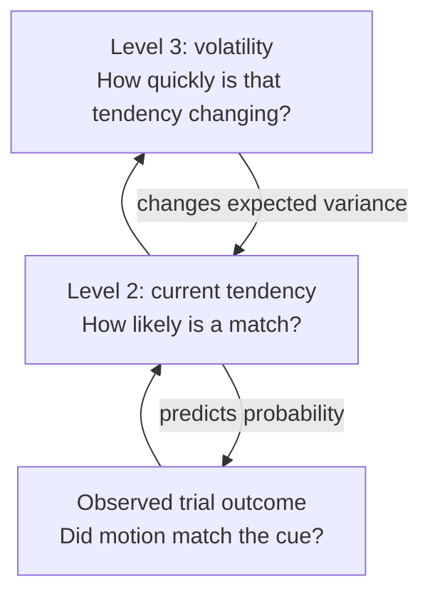
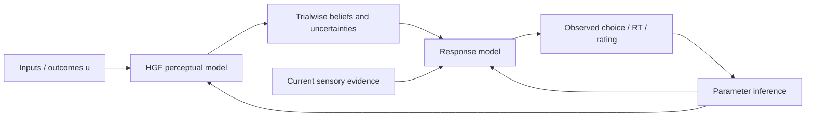
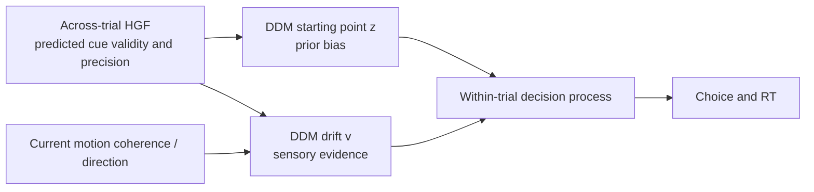
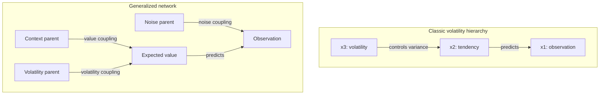

# Hierarchical Gaussian Filters: theory, research, software, and a BIDSEEG integration plan

**Research status:** 2026-07-22\
**Repository status:** design and feasibility review; no HGF results have been
produced\
**Recommended implementation:** PyHGF in a pinned, isolated environment, after
restoring the missing learning history and creating stable trial identifiers

## Executive answer

A **Hierarchical Gaussian Filter (HGF)** is a computational model of how a
learner updates beliefs one observation at a time when the world may itself be
changing. It can estimate, on every trial:

- what outcome a participant should expect;
- how certain that expectation is;
- whether the latest outcome was surprising;
- how much the learner should update;
- whether the underlying environment appears stable or volatile.

The word _filter_ is easy to misunderstand in an EEG repository. An HGF is
**not** a high-pass, low-pass, temporal, spatial, or Gaussian signal filter. It
does not clean voltage data. It filters a sequence of observations into a
sequence of changing beliefs.

The HGF is scientifically promising for this project because the experiment
manipulates prior information and records trialwise choices, response times,
motion coherence, and EEG. HGF-derived beliefs and prediction errors could
become single-trial EEG regressors and could also provide dynamic predictors for
the existing HSSM/DDM analysis.

However, the present full-sample derivative is not ready for that analysis:

1. The 43 processed behavioral tables contain about 20,620 rows but **zero
   learning-block rows**. Acquisition history has already been discarded.
2. The existing identifiers are not unique because `thisN` restarts within each
   20-trial block. The key `(participant, block_cond, block_order, thisN)`
   produces only 1,720 unique combinations in the 18,795-row `EEG_iaf.csv`
   table.
3. The low-level test condition presents approximately 75% cue-congruent motion,
   while the high-level test condition presents approximately 50%. Those
   conditions should not be treated as replicas of one binary learning process.
4. A choice happens after the current random-dot-motion stimulus. A model that
   uses the participant's _post-outcome_ HGF belief to explain that same choice
   would leak information across the causal boundary. The response model must
   combine the **pre-outcome** prior prediction with the current sensory
   evidence.

The most defensible route is therefore:

1. recover the full, ordered PsychoPy trial history for every participant,
   including learning blocks;
2. create a permanent `trial_uid` before filtering responses or EEG epochs;
3. compare a static model, Rescorla-Wagner model, two-level HGF, three-level
   HGF, and a serious volatile-learning alternative;
4. require simulation, parameter recovery, model recovery, posterior predictive
   checks, and held-out comparison;
5. retain a three-level volatility interpretation only if this exact task can
   recover it;
6. export trialwise states to a separate derivative, then join them to cue-,
   RDK-, and response-locked EEG by `trial_uid`.

This document explains why.

---

## Part I — Build the intuition first

### A learner inside a changing world

Imagine that a tone usually predicts leftward motion. You have seen 15 mostly
congruent trials, so you expect the next motion direction to match the tone.
Then an incongruent trial appears.

How much should that one trial change your belief?

- If you think the relationship is stable and outcomes are somewhat noisy,
  perhaps very little.
- If you think the relationship has just changed, perhaps a great deal.
- If you are unsure whether the environment is stable, the surprising trial
  should also update your estimate of volatility.

A fixed-learning-rate rule cannot fully express that distinction. It changes by
the same fraction after every error. An HGF lets the effective learning rate
change because the learner is estimating uncertainty and volatility as well as
outcome probability.

The hierarchy is causal in the model:

- the upper state controls how quickly the state beneath it is expected to move;
- the lower state predicts observations;
- prediction errors travel upward and update beliefs;
- predictions travel downward.

### Why the name has three parts

| Word             | Meaning                                                                                                                                                                                  |
| ---------------- | ---------------------------------------------------------------------------------------------------------------------------------------------------------------------------------------- |
| **Hierarchical** | Several hidden states are linked. A higher state can govern the variability or value of a lower state.                                                                                   |
| **Gaussian**     | Continuous hidden-state transitions, and the approximate posterior beliefs used by the classic derivation, are Gaussian. The observed outcome itself can still be binary or categorical. |
| **Filter**       | It performs sequential inference: the belief after trial `k` becomes the starting point for trial `k + 1`.                                                                               |

### What the levels mean in a standard binary HGF

For a binary sequence, the canonical three-level model is:

$$
u_k = x_{1,k} \sim \operatorname{Bernoulli}\left(\operatorname{sigmoid}(x_{2,k})\right)
$$

$$
x_{2,k} \sim \mathcal N\left(x_{2,k-1},\; t_k\exp(\omega_2 + \kappa x_{3,k-1})\right)
$$

$$
x_{3,k} \sim \mathcal N\left(x_{3,k-1},\; t_k\theta\right)
$$

The pieces are:

- $u_k$: the observed binary event on trial $k$;
- $x_{2,k}$: the hidden log-odds of that event;
- $\operatorname{sigmoid}(x_{2,k})$: the corresponding probability between 0 and
  1;
- $x_{3,k}$: inferred log-volatility — how quickly $x_2$ is expected to change;
- $\omega_2$: tonic or baseline log-volatility at level 2;
- $\kappa$: strength of the volatility coupling from level 3 to level 2;
- $\theta$: meta-volatility, or how quickly level 3 itself changes;
- $t_k$: time elapsed since the preceding observation.

Because $x_2$ is a log-odds value:

- $x_2=0$ means probability $0.5$;
- $x_2>0$ favors outcome 1;
- $x_2<0$ favors outcome 0.

A high $x_3$ does **not** mean outcome 1 is likely. It means that the
probability represented at level 2 is believed to be changing rapidly.

Some implementations write the top-level variance as $\exp(\omega_3)$ instead of
$\theta$. Parameter symbols and transforms differ across TAPAS, PyHGF, Julia
packages, and papers. A reproducible analysis must state the exact
implementation, version, update rule, and parameterization rather than comparing
parameter names at face value.

### One trial of inference

The HGF repeats a predict-observe-update cycle.

For a continuous level $i$, predicted variance has the approximate form

$$
\hat\sigma_{i,k}=\sigma_{i,k-1}+\Omega_{i,k},
$$

where

$$
\Omega_{i,k}=t_k\exp(\omega_i+\kappa_i\mu_{i+1,k-1})
$$

is newly expected process variance. Precision is inverse variance:

$$
\pi_{i,k}=\frac{1}{\sigma_{i,k}}.
$$

At the binary observation level, the predicted probability and raw outcome
prediction error are

$$
\hat p_k=\operatorname{sigmoid}(\hat\mu_{2,k}),
$$

$$
\delta_{1,k}=u_k-\hat p_k.
$$

The update looks like a delta rule,

$$
\Delta\mu_{2,k}=\text{adaptive gain}_k\,\delta_{1,k},
$$

but the gain changes with relative uncertainty. In a standard binary formulation
this is commonly written as

$$
\mu_{2,k}=\hat\mu_{2,k}+\sigma_{2,k}\delta_{1,k}.
$$

A volatility prediction error can be written as

$$
\delta_{2,k}=
\frac{\sigma_{2,k}+(\mu_{2,k}-\hat\mu_{2,k})^2}{\hat\sigma_{2,k}}-1.
$$

It asks whether the total change and uncertainty at level 2 were larger or
smaller than level 3 predicted. A generic higher-level mean update is

$$
\Delta\mu_{3,k}=\frac{\kappa}{2}\sigma_{3,k}w_{2,k}\delta_{2,k},
$$

with volatility weight

$$
w_{2,k}=\frac{\Omega_{2,k}}{\hat\sigma_{2,k}}.
$$

The exact algebra depends on HGF variant and parameterization. The durable idea
is:

> An error matters in proportion to the confidence placed in the new evidence
> relative to the confidence placed in the old belief.

That is the source of a trial-varying learning rate.

### Four kinds of uncertainty that must not be mixed up

| Quantity                                | Plain-language meaning                                                  | Example                                                       |
| --------------------------------------- | ----------------------------------------------------------------------- | ------------------------------------------------------------- |
| Estimation or informational uncertainty | “I have not seen enough evidence yet.”                                  | Only two cue-motion pairings have occurred.                   |
| Volatility                              | “The hidden probability itself may be changing.”                        | A cue that used to be reliable appears to be losing validity. |
| Sensory uncertainty                     | “The observation is hard to perceive.”                                  | Low-coherence motion makes left versus right uncertain.       |
| Outcome stochasticity or risk           | “The probability is stable, but outcomes are inherently probabilistic.” | A stable 75% cue still fails on 25% of trials.                |

This experiment contains both sensory uncertainty (`coh`/`coh_level`) and
probabilistic cue validity. A model that attributes every surprising trial to
volatility can mistake ordinary 25% incongruence or low-coherence perceptual
noise for a changing environment. This is why the response model and comparison
models matter.

### The outputs people usually take from an HGF

| Family           | Example trialwise quantity                            | When it exists                       |
| ---------------- | ----------------------------------------------------- | ------------------------------------ |
| Prediction       | predicted probability, predicted hidden mean          | Before observing the current outcome |
| Confidence       | predicted variance or precision                       | Before the outcome                   |
| State estimate   | posterior hidden mean and variance                    | After the outcome update             |
| Value error      | raw or precision-weighted outcome prediction error    | After the outcome                    |
| Volatility error | raw or precision-weighted volatility prediction error | After the lower-level update         |
| Adaptation       | effective learning rate                               | During/after the update              |
| Surprise         | negative log probability or model-specific surprise   | After the outcome                    |

The words **predicted** and **posterior** must be part of column names. A
posterior belief has already incorporated the current outcome; a predicted
belief has not. Confusing them can create circular behavioral analyses and
temporally impossible EEG claims.

---

## Part II — What an HGF is, and is not, relative to nearby models

### The two models hidden inside “fit an HGF”

An HGF analysis needs both:

1. a **perceptual model**, which maps the presented outcome sequence into hidden
   beliefs; and
2. a **response model**, which maps those beliefs into observed choices,
   response times, confidence ratings, or physiology.

Running a filter with fixed parameters is not the same as fitting a participant.

For binary choices, a simple response rule may transform a belief-derived
probability $m_k$ with inverse-noise parameter $\zeta$:

$$
P(y_k=1)=\frac{m_k^\zeta}{m_k^\zeta+(1-m_k)^\zeta}.
$$

But this is only one possibility. A response model can include current motion
evidence, condition, volatility-dependent decision noise, reaction time, or a
full evidence-accumulation likelihood.

Without a response model, `Network.input_data(...)` in PyHGF runs a
fixed-parameter filter. It does not estimate how a particular participant
learns.

### HGF versus common alternatives

| Model                            | What it does                                                                        | Relationship to HGF                                                                                           | When it may be better                                                                       |
| -------------------------------- | ----------------------------------------------------------------------------------- | ------------------------------------------------------------------------------------------------------------- | ------------------------------------------------------------------------------------------- |
| Rescorla-Wagner / delta rule     | Updates value with a fixed learning rate                                            | Same error-times-learning-rate skeleton, but HGF derives a changing gain from uncertainty                     | Stable tasks, limited trials, or when HGF parameters cannot be recovered                    |
| Kalman filter                    | Recursive Bayesian state estimation in a linear-Gaussian system                     | A simple fixed-volatility continuous HGF is Kalman-like; HGF adds nonlinear/hierarchical volatility structure | Linear dynamics with known or simply parameterized noise                                    |
| Extended/unscented Kalman filter | Approximates nonlinear state-space inference                                        | General-purpose alternative approximation                                                                     | When HGF-specific variational updates are not appropriate                                   |
| Volatile Kalman Filter (VKF)     | Tracks value and volatility with a compact approximation                            | Direct volatile-learning competitor                                                                           | When a simpler and often numerically robust volatility model is desired                     |
| Hidden Markov model              | Infers discrete latent regimes                                                      | HGF usually assumes continuously drifting states                                                              | Abrupt switches among distinct contexts                                                     |
| Bayesian change-point model      | Infers sudden resets/change points                                                  | HGF normally adapts continuously through volatility                                                           | Explicit reversals or abrupt contingency changes                                            |
| Predictive coding                | A broad computational/neural framework of predictions and precision-weighted errors | HGF supplies one formal temporal generative model compatible with predictive-coding interpretations           | Not itself a competing behavioral likelihood; neural implementation requires extra evidence |
| Active inference                 | Models inference plus policies/actions and expected free energy                     | HGF can serve as a perceptual component                                                                       | When action selection and epistemic value are central                                       |
| Drift diffusion model (DDM)      | Models within-trial evidence accumulation, choice, and RT                           | Complementary: HGF provides across-trial beliefs; DDM explains the decision on one trial                      | Choice/RT mechanism rather than learning history                                            |

There are also two very different meanings of **hierarchical** in this
repository:

- In an HGF, hierarchy means hidden-state levels: outcome tendency, volatility,
  and perhaps meta-volatility.
- In the existing HSSM analysis, hierarchy means population partial pooling:
  trials nested in participants and participants nested in groups/conditions.

PyMC can place hierarchical group priors over HGF parameters, so a final model
can contain both kinds of hierarchy. They still answer different questions.

### HGF and the DDM can be joined

This is a particularly good conceptual match for the current project:

A plausible scientific hypothesis is that predicted prior strength shifts
starting point $z$, while current motion coherence primarily changes drift $v$.
Precision or prediction error could also modulate drift or threshold, but every
mapping must be preregistered and compared with alternatives.

The Predictive Accumulation Model (PAM) literature explicitly integrates HGF/VKF
learning with evidence accumulators. It is a useful design reference, but its
currently visible codebases vary in maturity and should not be copied into this
production pipeline without independent testing.

---

## Part III — Classic, generalized, and newer HGFs

### Classic HGF

The original framework was introduced by
[Mathys et al. (2011)](https://doi.org/10.3389/fnhum.2011.00039) and developed
in [Mathys et al. (2014)](https://doi.org/10.3389/fnhum.2014.00825). Its most
familiar hierarchy is connected through **volatility coupling**: a parent
changes the variance of its child.

This yields compact trialwise quantities that have been widely used in
computational psychiatry and model-based neuroimaging. It is an approximate
variational Bayesian filter, not exact inference for arbitrary environments.

### Generalized HGF

The researcher named in the request is **Lilian Aline Weber** (one `l` in
Lilian; surname Weber), whose
[Oxford profile](https://www.psych.ox.ac.uk/team/lilian-weber) lists work at the
intersection of computational modeling, EEG/MEG, neuromodulation, and
uncertainty. Her ORCID is
[`0000-0001-9727-9623`](https://orcid.org/0000-0001-9727-9623).

The
[generalized Hierarchical Gaussian Filter](https://elifesciences.org/reviewed-preprints/110174v1),
also available as [arXiv:2305.10937](https://arxiv.org/abs/2305.10937), broadens
the architecture beyond the classic chain. Its major additions include:

- **value coupling**: a parent can predict or change the child's mean/value;
- **volatility coupling**: the classic parent-to-child variance relationship;
- observation-noise coupling;
- multiple parents and children;
- nonlinear coupling functions;
- drift and autoregressive/mean-reverting dynamics;
- irregular observation intervals;
- broader exponential-family node formulations.

As of 2026-07-22, the cited eLife item is a **Reviewed Preprint**, not a
conventional final Version of Record. The public assessment considers the
framework valuable and its simulation/generative-recovery work convincing, while
also noting that the paper does not yet demonstrate broad empirical superiority
over existing filters or explain a wide set of empirical phenomena better. That
is exactly the right evidential boundary: greater expressiveness is not
automatic evidence that a more complex model is warranted for this dataset.

### Generalized HGF versus enhanced/robust update variants

These labels should not be collapsed:

- **gHGF / generalized HGF** refers to the compositional network architecture
  and expanded coupling types.
- **eHGF / enhanced or newer update formulations** concerns revised inference
  behavior and numerical robustness in parts of the HGF family.
- The 2026 preprint
  [Robust volatility updates for Hierarchical Gaussian Filtering](https://arxiv.org/abs/2605.00966)
  proposes an unbounded formulation designed to prevent invalid precisions and
  improve large-error behavior.

The robust-volatility work is technically relevant to PyHGF 0.3 defaults, but it
remains a preprint. An analysis must record whether it used classic or unbounded
volatility updates; those are not harmless software settings.
