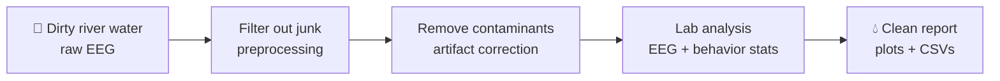
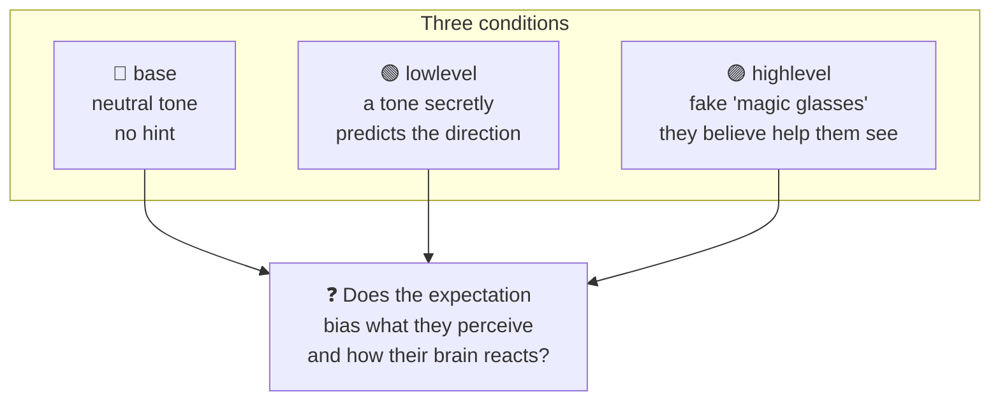
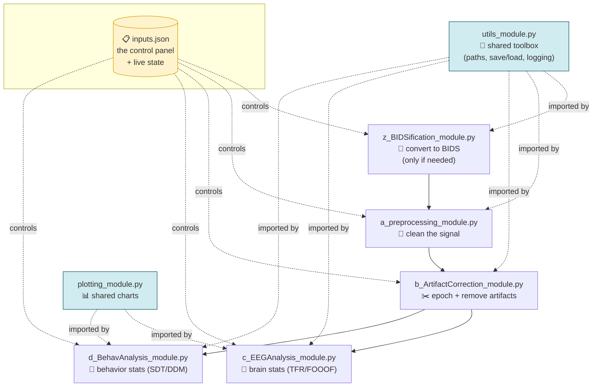
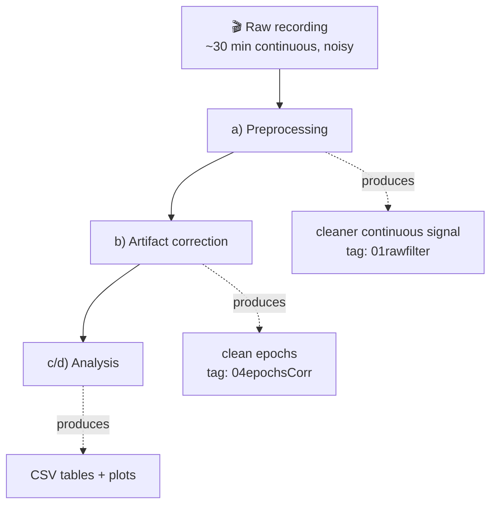
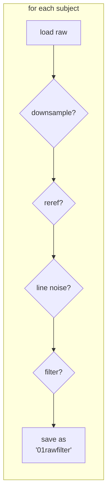
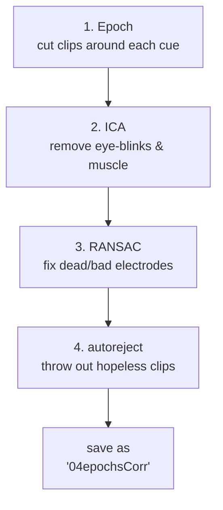
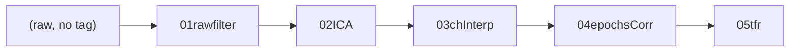
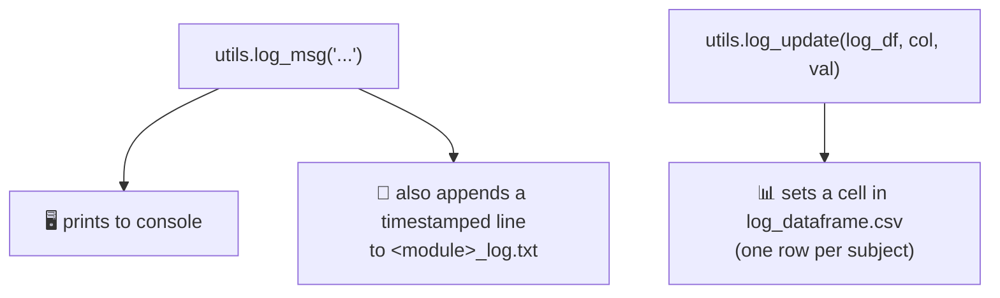
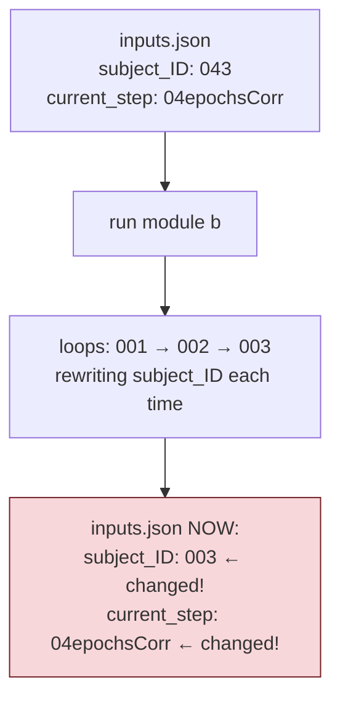
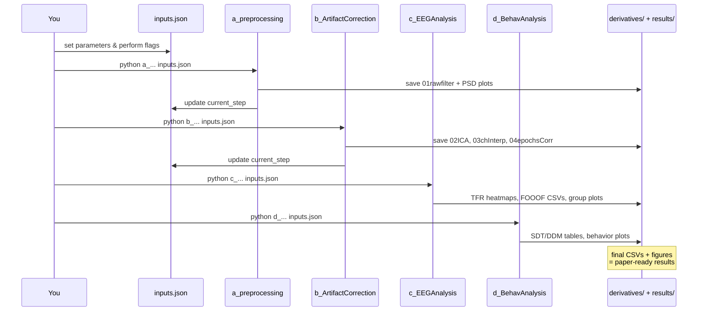

# Architecture & Onboarding Guide

A detailed, beginner-friendly walkthrough of the BIDS-EEG processing pipeline — assuming **zero EEG background**. Lots of analogies and diagrams. If you're new to this repo, read this top to bottom.

> For the terse, task-oriented reference (commands, gotchas, conventions), see [`CLAUDE.md`](../CLAUDE.md). This document is the *teaching* version.

---

## Part 1: The 30,000-foot view — what does this thing actually do?

### The one-sentence version

> This repo takes **raw brain-wave recordings** from an experiment, **cleans them up**, and then **runs statistics** to answer a research question: *"Does expecting something change how your brain processes what you see?"*

### The analogy: a water purification plant 💧

Think of the whole pipeline as a **water treatment plant**.



- **Dirty river water** = raw brain recordings. Full of noise: electrical hum from the wall, eye-blinks, muscle twitches, heartbeats.
- **Filtering stages** = the code removes each type of junk in order.
- **Lab analysis** = once clean, you measure things and run statistics.
- **Final report** = CSV tables and plots that go into a research paper.

The genius (and the headache) of this repo is that **the entire plant is controlled by one settings file: `inputs.json`**. You turn knobs in that file, and the plant behaves differently. No code editing required to run it.

---

## Part 2: What is EEG, really? (the part nobody explains)

**EEG = Electroencephalography.** You put a stretchy cap with ~30–60 metal electrodes on someone's scalp. Each electrode measures tiny voltage changes (microvolts) caused by millions of neurons firing underneath it.

So the raw data is basically a **giant spreadsheet**:

```
            electrode_O1   electrode_Oz   electrode_O2   ...
time 0.000      -2.3 µV        1.1 µV        -0.8 µV
time 0.002      -2.1 µV        1.4 µV        -0.9 µV
time 0.004      -2.5 µV        0.9 µV        -0.7 µV
   ...
```

- **Rows = time**, sampled hundreds of times per second (e.g. 250 Hz = 250 rows per second).
- **Columns = electrodes** (channels), each at a known scalp location (O1, Oz, O2 are at the back of the head, over the visual cortex).

That's it. EEG is just **"voltage at each electrode, over time."** Everything the pipeline does is shaping this spreadsheet and extracting numbers from it.

### Two key EEG vocab words you'll see everywhere

| Term | Plain meaning | Analogy |
|---|---|---|
| **Raw** | The continuous, unbroken recording (the whole spreadsheet). | A full movie reel. |
| **Epoch** | A short slice cut around an event (e.g. -0.6s to +1.5s around "image appeared"). | A 2-second clip cut out of the movie every time something interesting happens. |

The pipeline's job is largely: **take the long Raw recording → chop it into Epochs around events → clean those epochs → measure them.**

---

## Part 3: The experiment behind the data (so the numbers mean something)

The bundled data is from a **"Hierarchical Priors"** study. Here's the plain-English setup:

A person watches a cloud of moving dots (a "random dot kinematogram" — think TV static that drifts slightly left or right). Their job: **press left or right** for which way the dots are moving. It's deliberately hard.

The twist — the researchers gave people **expectations** ("priors") before the dots appeared, in three conditions:



**The research question:** Does *expecting* leftward motion make you *see* (and decide) leftward more — and can we measure that bias both in **behavior** (their button presses & reaction times) and in **brain activity** (EEG over the visual cortex)?

That's why there are **two analysis modules**: one for behavior (module `d`) and one for brain signals (module `c`). You don't need to understand the neuroscience to work on the code — but knowing *why* the code splits everything by `base`/`lowlevel`/`highlevel` will save you a lot of confusion.

> 📄 The file [`ExperimentGuide_HierarchicalPriors.md`](../ExperimentGuide_HierarchicalPriors.md) is the dictionary for all the per-trial labels (`exp`, `prior`, `coh`, `response_prior`, etc.). Keep it open when you touch analysis code.

---

## Part 4: The big architecture — 5 scripts + 1 shared toolbox

Here's the whole repo as a map:



**Reading the map:**
- The letters `a → b → c/d` are the **run order**. (`z` is a one-time prep step if your data isn't already in the standard format.)
- Notice `c` (brain) and `d` (behavior) **both branch off after `b`** — they're independent analyses of the same cleaned data. You can run them in either order.
- `utils_module.py` is the **shared toolbox** every script leans on.
- `inputs.json` (yellow) is connected to *everything* — it's both the control panel **and**, sneakily, a scratchpad the pipeline writes to as it runs (more on this in Part 7 — it's the #1 gotcha).

### The naming convention is the run order
`a_`, `b_`, `c_`, `d_` literally tell you the sequence. `z_` is named with a `z` because it's the "off to the side, run-only-if-needed" tool. Nice and discoverable.

---

## Part 5: What each module does (plain terms + the tech)

Let's walk through the funnel. Picture the data getting cleaner and smaller at each stage:



### Module `a` — Preprocessing (basic cleaning) 🧹

**Goal:** Make the continuous signal cleaner *without* cutting it up yet. Four optional steps:

| Step | Plain meaning | Why |
|---|---|---|
| **Downsample** | Keep fewer time-points per second (e.g. 1000 → 250 Hz). | Smaller files, faster processing. You don't need 1000 samples/sec for slow brain waves. |
| **Re-reference** | Voltage is always *relative*. Re-pick the "zero point." | Like deciding sea-level before measuring mountain heights. |
| **Line-noise removal** | Delete the 50/60 Hz hum from electrical wiring. | The wall socket leaks into the recording. (Off by default here.) |
| **Filter** | Keep only frequencies of interest (e.g. 0.1–40 Hz). | Throw away slow drifts and high-frequency fuzz. |

Each step is a function that takes `raw`, returns a cleaned `raw`, and is **wrapped in an `if perform_X:` check** driven by `inputs.json`. The whole thing loops over every subject.



> 💡 **Tech detail:** Every step also calls `diagnostic_plots()`, which saves a "Power Spectrum Density" image — a snapshot of "how much of each frequency is in the signal" so you can *see* that filtering worked. These land in a `diagnostics/` folder.

### Module `b` — Artifact Correction (the heavy cleaning) ✂️

This is the most sophisticated module. Now we **chop into epochs** and remove biological junk. Order matters:



The three "smart" techniques, in plain terms:

- **ICA (Independent Component Analysis)** — Imagine a recording of an orchestra from one microphone. ICA mathematically *un-mixes* it back into separate instruments. Here it un-mixes the EEG into sources, then an AI labeler (`mne-icalabel`) tags which sources are "eye blink," "muscle," "heartbeat," etc. — and the code **deletes the junk sources** and re-mixes the rest. Blink contamination gone, brain signal kept.

  *Analogy:* removing the singer's cough from a song without re-recording.

- **RANSAC** — Detects electrodes that went bad (fell off, dried out) and **rebuilds** their signal by interpolating from neighboring electrodes. Like Photoshop "content-aware fill" for a dead sensor.

- **autoreject** — Some epochs (clips) are just too contaminated to save. This automatically finds and **discards** them, with a safety rule: if it'd throw away >20% of trials, it warns you (that subject's data is suspect).

> 💡 Notice module `b` **also reads the raw behavioral PsychoPy logs** (`behavdata_prep`) to attach trial info (which condition, reaction time, etc.) onto each epoch as `epochs.metadata`. This is the marriage of "brain data" + "what the person did" — crucial, because all later analysis splits by these labels.

### Module `c` — EEG Analysis (measuring the brain) 🧠

Now the data is clean. Time to extract numbers. Two main techniques:

- **TFR (Time-Frequency Representation)** — Brain rhythms change over time. A TFR is a **heatmap**: time on the x-axis, frequency on the y-axis, color = power. Like a music equalizer's bouncing bars, but as a picture across the whole trial.

  ```
  freq ▲  [a heatmap of brain rhythm power]
   40Hz│ ░░░▒▒▓▓░░
       │ ░▒▓██▓▒░░
    5Hz│ ░░░▒▒░░░░
       └──────────▶ time
  ```
  It then runs **cluster-based permutation tests (CBPT)** — a statistics method to ask "is the difference between conditions in this heatmap *real* or just chance?"

- **FOOOF / SpecParam** — Separates a brain's frequency spectrum into two parts: the **"aperiodic"** background slope (general excitability) and the **"periodic"** bumps (true oscillations, like the alpha rhythm at ~10 Hz). This study cares a lot about both. Think of it as separating the *bassline hum* of a room from the *actual notes* being played.

It runs per-subject, then a **group-level** pass averages across everyone and makes the final plots/CSVs.

### Module `d` — Behavioral Analysis (measuring the choices) 🎯

This module ignores brain signals and looks only at **button presses and reaction times**. Two models:

- **SDT (Signal Detection Theory)** — Measures *bias*. Did the person lean toward saying "left" when they expected left, even when wrong? Produces a "criterion" number; negative = biased toward the prior. *Analogy:* a referee who's slightly biased toward the home team.

- **DDM (Drift Diffusion Model)** — A beautiful model of *how* decisions unfold over time. It imagines evidence "accumulating" like a ball rolling toward one of two walls; the model fits parameters like:
  - **drift** = how fast evidence accumulates (sensitivity),
  - **boundary** = how much evidence you need before committing (caution),
  - **starting point** = your *bias* before any evidence arrives. ← this is where "expectation" shows up!

  ```mermaid
  flowchart LR
      S["start point<br/>(bias)"] -->|drift rate| B1["⬆️ 'left' boundary"]
      S -->|noise wobbles| B2["⬇️ 'right' boundary"]
  ```

It uses the `pyddm` library, then merges results with questionnaire/trait data and plots everything.

---

## Part 6: The clever shared machinery (`utils_module.py`)

This is where the real engineering lives. Three systems worth understanding deeply, because **you'll touch them constantly** when adding features.

### 6a. BIDS paths + the "processing step" chain

**BIDS** is just a **standardized folder/filename convention** for brain data, so any lab's tools can find any other lab's files. Like how every library uses the same Dewey Decimal system.

A filename encodes metadata in `key-value` chunks:
```
sub-001_ses-01_task-HierPrior_proc-04epochsCorr_eeg.fif
└─subject  └─session  └─task        └─ pipeline stage!
```

That `proc-` (processing) chunk is the **pipeline's progress tracker**. Each stage stamps its output:



`utils.get_bidspath()` builds these paths; `load_preprocessing_step()` reads a given stage; `save_preprocessing_step()` writes one. **This is how modules hand off to each other** — `b` saves `04epochsCorr`, and `c` knows to load `04epochsCorr`.

### 6b. The type-dispatched saver (a neat trick)

`save_preprocessing_step()` is one function that saves *any* kind of object correctly. It looks at the object's **type** and picks the right format:

```python
match str(type(file)):
    case "<class '...RawEDF'>":        # continuous → write BIDS EDF
    case "<class '...Epochs'>":        # epochs → .fif
    case "<class '...AverageTFR'>":    # heatmaps → .fif
    case "<class '...AutoReject'>":    # autoreject obj → .hdf5
    case "<class '...ICA'>":           # ICA obj → .fif
    ...
    case _:  print("NOT SAVED")        # ⚠️ silent-ish fallthrough
```

*Analogy:* a smart recycling bin that reads what you toss in and routes glass/paper/plastic to the right container. **When you add a new data type, you add a `case` here** — otherwise it hits the `_` branch and silently doesn't save.

### 6c. The dual logging system



- **`log_dataframe.csv`** = the quantitative provenance ledger: filter cutoffs used, % epochs removed, RT-outlier counts. Columns get created on the fly. This is your reproducibility goldmine.
- **`<module>_log.txt`** = the human-readable diary. (Fun detail: `log_msg` literally redirects `sys.stdout` to the file to write each line, then restores it.)

---

## Part 7: The #1 gotcha you MUST internalize 🚨

**`inputs.json` is not a read-only config file. The pipeline writes to it while running.**

Most people assume a "settings file" is sacred and unchanging. Here, it's **both the control panel AND a live scratchpad.** As the code loops over subjects, it does:

```python
utils.update_inputs(sys.argv[1], 'basic', 'subject_ID', subject)      # overwrites!
utils.update_inputs(sys.argv[1], 'basic', 'current_step', '02ICA')    # overwrites!
```



**Consequences for you:**
1. After a run, `inputs.json` reflects the **last subject and last step**, not what you started with. `git diff` will look "dirty" even though you only ran the pipeline.
2. The next module **relies** on `current_step` pointing at the right stage to know what to load. It's an implicit baton-pass through the config file.
3. **Don't edit `inputs.json` while a module is running** — you'll race with the pipeline's own writes.

This design is fragile, and honestly it's the **first thing to flag for the "make it reproducible" goal.** A cleaner design passes state explicitly (function arguments / a separate run-state file) instead of mutating the user's config.

### A related gotcha
`utils_module.py` runs code **at import time** that reads `sys.argv[1]`. So you literally **cannot `import utils_module` in a plain Python REPL** without faking `sys.argv` — it'll crash looking for `inputs.json`. Every script must be launched as `python X_module.py inputs.json`.

---

## Part 8: Putting it all together — one full run



---

## Quick reference card

| Thing | Where | Plain meaning |
|---|---|---|
| Control panel | `inputs.json` | All knobs **+ live state (mutates!)** |
| Run order | `a → b → c/d` (`z` first if not BIDS) | Each script = `python X.py inputs.json` |
| Shared toolbox | `utils_module.py` | Paths, save/load, logging |
| Stage tracker | `proc-XX` in filenames | `01rawfilter→02ICA→03chInterp→04epochsCorr→05tfr` |
| On/off switches | `inputs.json` → `perform` block | Toggle any pipeline step |
| Provenance | `log_dataframe.csv` | What settings produced these results |
| Domain dictionary | `ExperimentGuide_*.md` | What every trial label means |

| EEG term | Plain meaning |
|---|---|
| Raw | The whole continuous recording |
| Epoch | A short clip cut around an event |
| ICA | Un-mix signal to delete blinks/muscle |
| RANSAC | Rebuild dead electrodes from neighbors |
| autoreject | Auto-discard hopeless clips |
| TFR | Time × frequency power heatmap |
| FOOOF | Split spectrum into background slope + true oscillations |
| SDT | Measures decision *bias* |
| DDM | Models *how* a decision accumulates over time |

---

## Natural next directions (reproducibility + features)

1. **Fix the `inputs.json`-mutation fragility** — biggest reproducibility win. Pass state explicitly instead of mutating the user's config.
2. **Add a test harness** — there are currently zero tests; the bundled 3-subject dataset is perfect for a smoke test.
3. **A single orchestrator** — one command to run `a→b→c→d` instead of four manual invocations.
