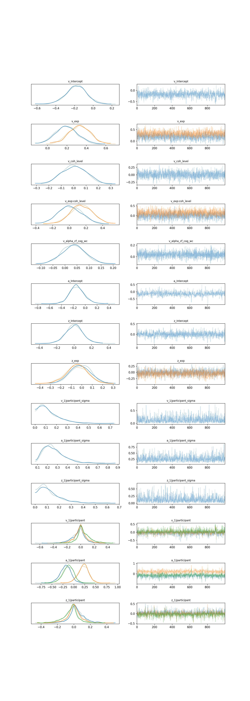
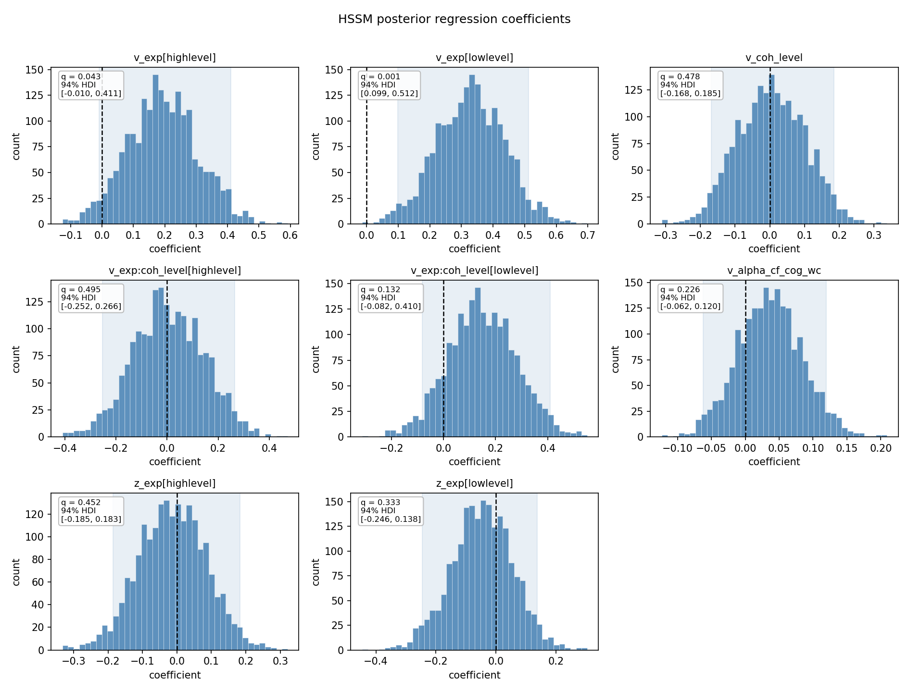
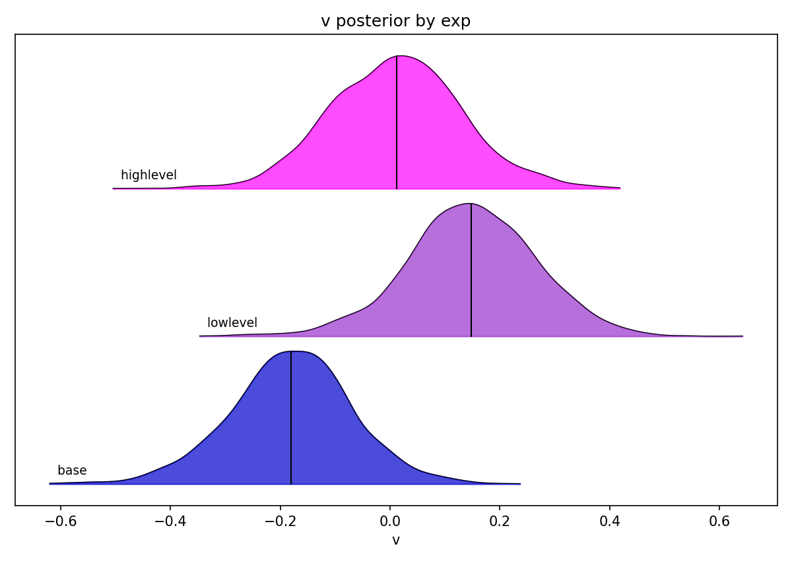
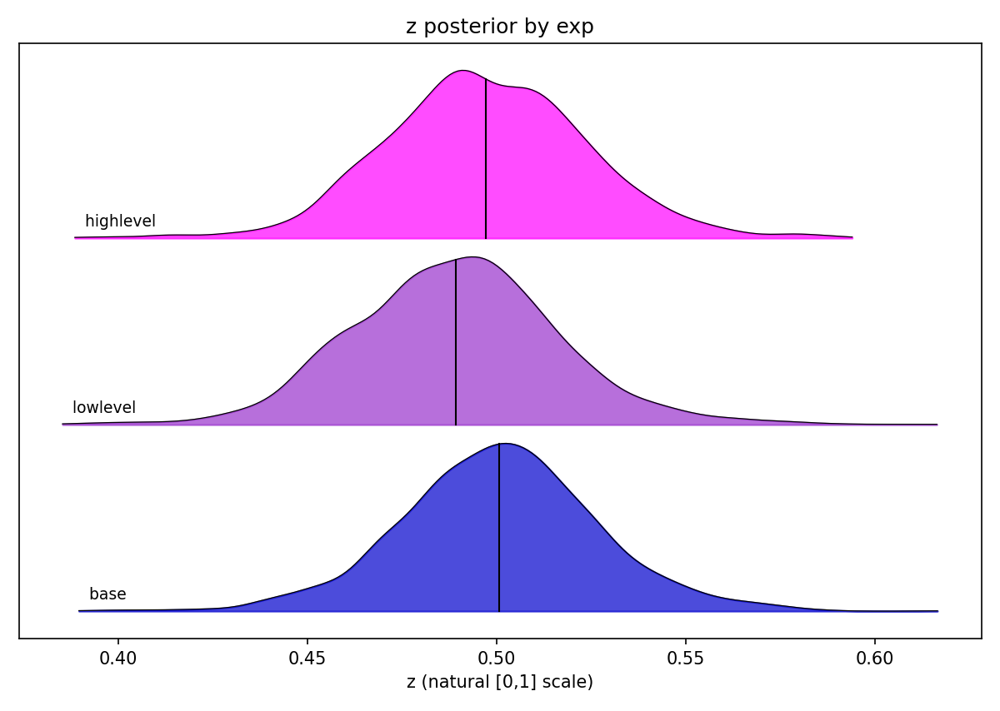
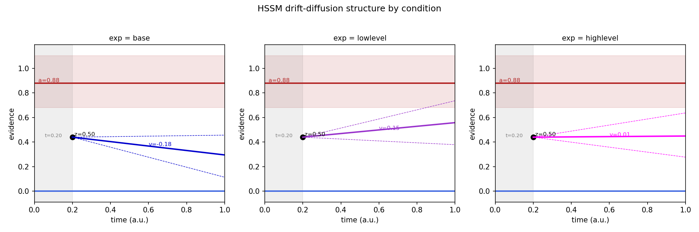

# 05 — The HSSM / DDM plots from this session

This note walks through every figure the pipeline now produces for the **Hierarchical
Bayesian drift-diffusion model (HSSM)**. For each plot you get the picture, *what it is*,
*how to read it*, *what it shows in our demo data*, and *which paper it is modelled on*.

The plotting code lives in `plotting_module.py` (functions prefixed `hssm_`) and is called
from `e_HSSM_module.py` after the model is fit. The fitted posterior is also saved to
`hssm_idata.nc`, so any of these can be **regenerated without re-running the multi-minute
fit** (see *Regenerating the figures* at the end).

See also: [`./02-paper-summaries.md`](./02-paper-summaries.md) (the source papers) and
[`./04-hssm-questions.md`](./04-hssm-questions.md) (open modelling decisions).

> ### ⚠️ Read this first: these are DEMO numbers, not findings
> Everything below was fit on the **3-subject demo dataset** (the Hierarchical-Priors
> random-dot-kinematogram (RDK) task). With n = 3, the figures exist to prove the
> *plumbing* works — that the model fits, converges, and plots correctly. **Do not
> interpret any effect as a scientific result.** A rule of thumb: don't read tea leaves
> below ~10 observations. The value here is the *machinery*; it carries straight over to
> the full dataset and to the Natural-Uncertainty study.

---

## A 5-minute crash course (so the plots make sense)

### The drift-diffusion model (DDM) in one breath

A DDM is a model of a **single two-choice decision**. The idea: when a stimulus appears,
the brain accumulates noisy evidence over time. That running total is a point that drifts
up or down until it hits one of two boundaries — and *which* boundary it hits is the
choice, *how long* it took is the reaction time (RT). One model therefore explains both
**accuracy and RT** at once, and it decomposes them into psychologically meaningful pieces.

The four standard DDM parameters — keep this table handy, every plot refers to them:

| Symbol | Name | Plain meaning | Where it shows up |
|--------|------|---------------|-------------------|
| **v** | drift rate | *Quality/speed of evidence.* How fast (and which way) the evidence accumulates. High `v` = easy, fast, accurate; `v` near 0 = guessing; sign = which option the evidence favours. | the slope of the line in the schematic |
| **a** | boundary separation (a.k.a. threshold) | *Caution.* The gap between the two decision boundaries. Wider `a` = more evidence required = slower but more accurate (the speed–accuracy trade-off). | the red top line in the schematic |
| **z** | start point (bias) | *Pre-evidence bias.* Where accumulation begins between the boundaries. `z = 0.5` is neutral; `z` shifted toward one boundary means you lean that way *before* seeing the stimulus. | the black dot in the schematic |
| **t** | non-decision time | *Everything that isn't deciding* — sensory encoding + motor execution. A flat offset added to every RT. | the grey band in the schematic |

**The key conceptual split (this is the whole point of the modelling):**
- `v` is an **in-evidence** bias — the prior tilts the *accumulation itself*.
- `z` is a **pre-evidence** bias — the prior moves the *starting line* before any
  evidence arrives.

Two very different stories produce similar behaviour, and the DDM is what lets us tell
them apart. Jonathan's working hypothesis: the **low-level prior moves `z`** (start
point), while **`v` is driven by both** the prior and the EEG alpha signal. That is
exactly why the model below puts the experimental factor on *both* `v` and `z`.

### What "Bayesian posterior", "HDI" and "q" mean

We fit the model in a **Bayesian** way, which means the answer for each parameter is not a
single number but a whole **distribution** — the *posterior* — that says how plausible each
value is given the data. Three terms recur in the plots:

- **Posterior** — the distribution of credible values for a parameter after seeing the
  data. We approximate it by drawing thousands of samples (here 2 chains × 1000 draws).
  A histogram or density curve of those samples *is* the posterior.
- **HDI (highest-density interval)** — the Bayesian analogue of a confidence interval.
  The **94% HDI** is the narrowest range that contains 94% of the posterior mass; the
  values inside are the most credible. (94% is just ArviZ's convention — chosen partly so
  no one mistakes it for the magic 95%.)
- **q = probability of direction** — the fraction of the posterior sitting on the
  *opposite* side of zero from the bulk. It is the Bayesian cousin of a p-value: **small q
  = the effect is credibly non-zero** (the posterior almost entirely picks one sign).
  `q ≈ 0.002` means only 0.2% of the samples cross zero — a credibly directional effect;
  `q ≈ 0.5` means the posterior straddles zero and we can't even call its sign.

### The model behind every plot

The demo was fit with these formulas (from `inputs.json`, `Analysis.hssm`):

```
v ~ 1 + exp * coh_level + alpha_cf_cog_wc + (1|participant)
z ~ 1 + exp + (1|participant)
a ~ 1 + (1|participant)
t  = 0.2   (fixed)
```

How to read those formulas:
- `exp` is the experimental factor — the prior condition — with three levels: **base**,
  **lowlevel**, **highlevel**. (`base` is the reference level.)
- `coh_level` is motion **coherence** (the RDK difficulty). `exp * coh_level` includes
  both main effects *and* their interaction.
- `alpha_cf_cog_wc` is the **per-trial EEG alpha covariate** — this is where the brain
  signal enters the behaviour model, letting us ask "does trial-by-trial alpha predict the
  drift rate?"
- `(1|participant)` is a **random intercept**: each subject gets their own baseline offset,
  drawn from a shared group distribution. This is the "hierarchical" in HSSM — it pools
  information across subjects (partial pooling) instead of treating them as identical or
  fully independent.
- `t` is **fixed at 0.2** rather than estimated (a deliberate choice — see
  [`./04-hssm-questions.md`](./04-hssm-questions.md)). That is why `t` is a flat grey band,
  not a posterior, in the schematic.

A regression posterior stores an **intercept plus per-level offsets**, not one value per
condition. A condition's value is *reconstructed* by summing: `base = intercept`,
`lowlevel = intercept + lowlevel_offset`, and so on. The ridgeline and schematic functions
do exactly this reconstruction.

---

## 1. Convergence trace — `hssm_trace.png`



**What it is.** An MCMC **convergence diagnostic** — the most important sanity check before
you trust *anything* else. Markov-chain Monte Carlo (MCMC) is how we draw posterior
samples: each chain is a random walk that should settle into the posterior and explore it.
This plot shows, for every model variable, one row with two panels:
- **left** = the posterior **density** (smoothed histogram of the samples), with one curve
  per chain overlaid (compact mode);
- **right** = the **trace** — the sampled value at each iteration, for each chain.

**How to read it.**
- The trace (right) should look like a **fuzzy, stationary caterpillar**: a flat, dense,
  hairy band with no trends, no drift, no getting stuck. That means the chains are
  well-mixed and exploring the same region.
- The density (left) curves from different chains should **sit on top of each other**. If
  they disagreed, the chains found different answers and the fit isn't trustworthy.
- The numeric companion is **R-hat** (in `hssm_posterior_summary.csv`): you want
  **R-hat ≈ 1.00** (chains agree). Values much above 1.01 signal non-convergence.

**What it shows in our demo data.** Fourteen rows — the slope/intercept coefficients
(`v_Intercept`, `v_exp`, `v_coh_level`, `v_exp:coh_level`, `v_alpha_cf_cog_wc`,
`a_Intercept`, `z_Intercept`, `z_exp`), the random-effect spreads (`*_1|participant_sigma`)
and the per-subject offsets (`*_1|participant`). The traces are all fuzzy caterpillars and
the chains overlap, so sampling behaved. (Numbers themselves are demo-scale; this plot is
about *whether we can believe the sampler*, not about effects.)

**What changed this session.** This *replaced* the cramped default `az.plot_trace`, which
crammed ~15 variables with no spacing so the titles collided with the axis above. The fix:
**scale the figure height to the number of variables**, **drop the redundant non-centered
`_offset` duplicates** (a sampling reparameterisation, not a quantity you interpret), **add
row spacing**, and **shrink the titles**. (`hssm_trace` in `plotting_module.py`.)

**Modelled on.** No specific paper — this is the standard ArviZ trace diagnostic, just made
legible.

---

## 2. Posterior coefficients — `hssm_posterior_coefficients.png`



**What it is.** The **recreation of Romei & Tarasi (2026), Fig 4C.** One histogram per
regression **coefficient** (the slopes/offsets, not the bare parameters), showing that
coefficient's full posterior. Each panel has a **dashed vertical line at 0**, a **shaded
HDI band**, and a text box with **q** (probability of direction) and the **94% HDI**.

The function **auto-discovers** which variables to plot: it keeps the slope-like
coefficients and **skips** intercepts, the `_sigma` spreads, the `_offset`
reparameterisations, the random-effect terms (`1|...`), and the bare scalar parameters
(`a`, `t`, `z`) — for those a "line at zero" isn't the question.

**How to read it.**
- If the histogram sits **mostly to one side of the dashed zero line**, the effect is
  credibly directional → **small q**.
- If it is **centred on zero** (lots of mass on both sides), the sign is undetermined →
  **q ≈ 0.5**.
- The shaded band is the 94% HDI; if it **excludes 0**, the effect is credible at that
  level.

**What it shows in our demo data** (8 panels):

| Coefficient | What it asks | q (shown) | 94% HDI | Read |
|-------------|--------------|-----------|---------|------|
| `v_exp[lowlevel]` | does the low-level prior change drift vs base? | **0.001** | [0.099, 0.512] | almost entirely **above 0** → credibly positive drift |
| `v_exp[highlevel]` | high-level prior vs base on drift | 0.043 | [-0.010, 0.411] | mostly positive, HDI just grazes 0 |
| `v_coh_level` | does coherence change drift? | 0.478 | [-0.168, 0.185] | straddles 0 (demo data, no effect resolved) |
| `v_exp:coh_level[highlevel]` | prior × coherence interaction | 0.495 | [-0.252, 0.266] | straddles 0 |
| `v_exp:coh_level[lowlevel]` | prior × coherence interaction | 0.132 | [-0.082, 0.410] | leans positive, not credible |
| `v_alpha_cf_cog_wc` | **does EEG alpha predict drift?** | 0.226 | [-0.062, 0.120] | right direction, **straddles 0** at n=3 |
| `z_exp[highlevel]` | high-level prior on start point | 0.452 | [-0.185, 0.183] | straddles 0 |
| `z_exp[lowlevel]` | low-level prior on start point | 0.333 | [-0.246, 0.138] | leans negative (lower z), not credible |

The headline pattern (remember: *machinery demo*) is that the prior shows up on the **drift
rate** — `v_exp[lowlevel]` is the one coefficient credibly off zero. The **alpha→drift**
coefficient (`v_alpha_cf_cog_wc`) points the expected way but, with only 3 subjects, its
posterior comfortably includes zero (q ≈ 0.23). That is the *expected* outcome of an
underpowered demo, not a null result.

**Modelled on.** **Romei & Tarasi (2026), Fig 4C** — posterior-coefficient histograms with
a zero reference. See [`./02-paper-summaries.md`](./02-paper-summaries.md).

---

## 3. Drift-rate ridgeline — `hssm_ridgeline_v_by_exp.png`



**What it is.** A **ridgeline plot** in the style of **Franzen et al. (2025), Fig 5**:
stacked posterior **densities** (kernel-density estimates, KDEs) of the **drift rate `v`**,
one curve per `exp` condition (base, lowlevel, highlevel). Each condition's draws are
reconstructed from the regression (`base = v_Intercept`;
`lowlevel = v_Intercept + v_exp[lowlevel]`; etc.), with the other covariates held at their
centred mean of 0. The short vertical line in each curve marks the posterior **mean**.

**How to read it.** Read **left–right position**, not height. A curve sitting further right
= higher drift toward the upper boundary. Compare the **whole distributions**, not just the
means: heavy overlap between two curves means the conditions aren't cleanly separated. The
strength of a ridgeline (over three error bars) is that you see the **entire posterior
shift** between conditions.

**What it shows in our demo data.** The three curves are clearly offset:
- **base** sits around **v ≈ -0.18** (drift slightly toward the *lower* boundary),
- **lowlevel** shifts right to about **v ≈ +0.15** (drift now toward the *upper* boundary),
- **highlevel** is near **v ≈ +0.02** (roughly neutral).

So the low-level prior pushes the drift positive relative to base — the same story as the
credible `v_exp[lowlevel]` coefficient in plot #2, now shown as a full distribution. (Still
n = 3; the curves overlap a lot.)

**Modelled on.** **Franzen et al. (2025), Fig 5** — condition ridgelines. See
[`./02-paper-summaries.md`](./02-paper-summaries.md).

---

## 4. Start-point ridgeline — `hssm_ridgeline_z_by_exp.png`



**What it is.** The **same Franzen-style ridgeline**, but for the **start point `z`** across
`exp` conditions. This figure only exists because of the **"Option A" change** that put the
experimental factor on `z` (`z ~ 1 + exp + (1|participant)`) — see Q6 in
[`./04-hssm-questions.md`](./04-hssm-questions.md). Before that change, `z` had no condition
structure to plot.

**Crucial detail — the x-axis is the natural `[0, 1]` scale.** HSSM fits `z` on a **logit
scale** (so the optimiser can roam over all real numbers while `z` stays a valid
probability between 0 and 1). The plotting function applies the **inverse logit / expit**
to map the samples back to the interpretable `[0, 1]` start-point scale. Skipping that
back-transform would be a *silent* bug — the curves would plot, just in the wrong units.
The axis label `z (natural [0,1] scale)` is your reminder it was done.

**How to read it.** `z = 0.50` is an **unbiased** start point (dead centre between
boundaries). A curve shifted **left of 0.50** = start point biased toward the lower
boundary; **right of 0.50** = biased toward the upper boundary.

**What it shows in our demo data.** All three curves sit **near 0.50** — start-point biases
are small here. **lowlevel** is nudged slightly **left** of base (a touch lower `z`);
**highlevel** is essentially on top of base. That is the (badly underpowered) *hint* that
the low-level prior nudges the starting line — consistent with Jonathan's `z ~ low-level
prior` anchor — but the shift is tiny and the curves overlap almost completely. **Do not
read this as evidence at n = 3**; it is here to show the `z`-by-condition machinery works.

**Modelled on.** **Franzen et al. (2025), Fig 5** (same ridgeline function as plot #3,
`link='logit'`).

---

## 5. Drift-diffusion schematic — `hssm_ddm_schematic.png`



**What it is.** The cleaned-up **"anatomy of a drift-diffusion model"** cartoon — one panel
per `exp` condition (base, lowlevel, highlevel) — built from the *fitted* posterior. It is
the picture that makes the four parameters concrete. (Adapted and corrected from a
conference colleague's `DDM_Plots_functions.py`.)

**How to read it** — every element maps to a parameter from the table at the top:
- **Red top line = boundary separation `a`** (here `a ≈ 0.88`); the faint red band is its
  HDI. The **blue bottom line = 0** (the other boundary).
- **Black dot = the start point.** Its *height* is where evidence accumulation begins.
- **Coloured sloped line = the mean drift rate `v`** for that condition; the **dashed
  wedges** above and below are the drift's posterior **HDI** (uncertainty in the slope).
- **Grey band on the left = non-decision time `t`** (fixed at 0.20) — the pre-decision
  dead time before drift starts.

Reading the three panels: in **base** the drift line slopes **down** (`v = -0.18`, toward
the lower boundary); in **lowlevel** it slopes **up** (`v = 0.15`); in **highlevel** it is
nearly **flat** (`v = 0.01`). The boundary `a`, the start dot, and `t` are shared across
panels — in this model only `v` (and `z`, not visualised here) carry the condition factor,
so `a` and the start point repeat.

**Two bugs were fixed versus the original** (this is the load-bearing part):

1. **HSSM's `z` is *relative*, in `[0, 1]`.** The original drew the start dot at the raw
   `z` (~0.50). But a relative `z` must be multiplied by the boundary to get its *absolute*
   height: the dot belongs at **`z · a` (≈ 0.50 × 0.88 ≈ 0.44)**, not at 0.50. The label
   still reads `z = 0.50` (the relative value) but the dot now sits at the correct absolute
   height. Drawing it at 0.50 floated it above where accumulation really starts.
2. **The uncertainty wedges are now real.** The original *faked* the drift HDI by shifting
   the intercept's HDI around. Here the dashed wedges come from the **actual posterior draws**
   of `v` for each condition.

One more transform to know: **`a` is fit on a log scale internally**, so the code
back-transforms it with `exp()` before drawing — same family of "apply the inverse link"
care as the `expit` for `z` in plot #4.

**Modelled on.** Adapted (and corrected) from a conference colleague's
`DDM_Plots_functions.py` — a generic DDM-anatomy cartoon, not a specific paper figure.

---

## Regenerating the figures

You don't need to refit the model to redraw these. The fit is fast to *plot* from the
saved posterior because `e_HSSM_module.py` writes `hssm_idata.nc` (an ArviZ
`InferenceData` in NetCDF) next to the figures. In a quick script:

```python
import arviz as az
import plotting_module as plotting   # needs inputs.json as sys.argv[1] to import

idata = az.from_netcdf('.../results/groupBehavioral/.../hssm_idata.nc')
condition_dict = {"exp": ["base", "lowlevel", "highlevel"]}
result_dir = "."

plotting.hssm_trace(idata, result_dir)
plotting.hssm_posterior_coefficients(idata, result_dir)
plotting.hssm_posterior_ridgeline(idata, 'v', 'exp', condition_dict['exp'], result_dir, link='identity')
plotting.hssm_posterior_ridgeline(idata, 'z', 'exp', condition_dict['exp'], result_dir, link='logit')
plotting.hssm_ddm_schematic(idata, condition_dict, result_dir, t_value=0.2)
```

Each function follows the module convention: build/locate a save dir, `savefig`, `close`,
and `log`. They are all driven by `condition_dict`, so they carry over unchanged to the
Natural-Uncertainty dataset once its conditions are wired in.

---

## Cross-references

- [`./02-paper-summaries.md`](./02-paper-summaries.md) — Romei & Tarasi (2026) and Franzen
  et al. (2025), the figures these plots recreate.
- [`./04-hssm-questions.md`](./04-hssm-questions.md) — open modelling decisions, including
  why `t` is fixed and the `z ~ exp` ("Option A") change behind plot #4 (Q6).
- `docs/learning/14-hssm-posterior-plots.md` — the teaching note written when these
  functions were added.
