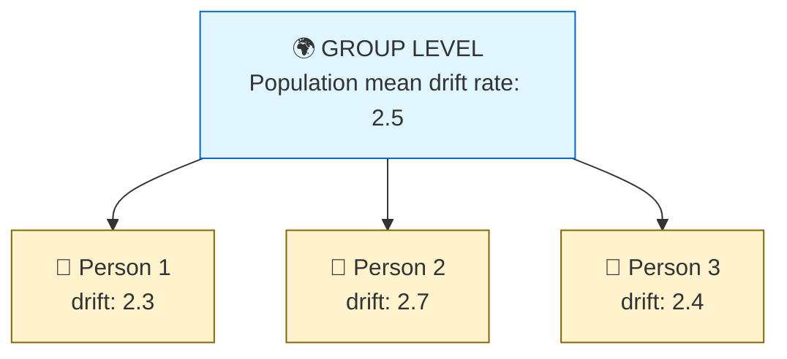
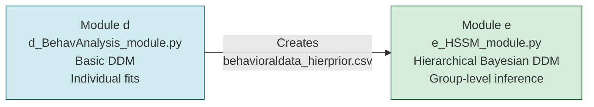
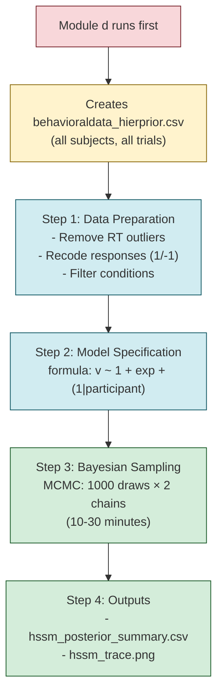
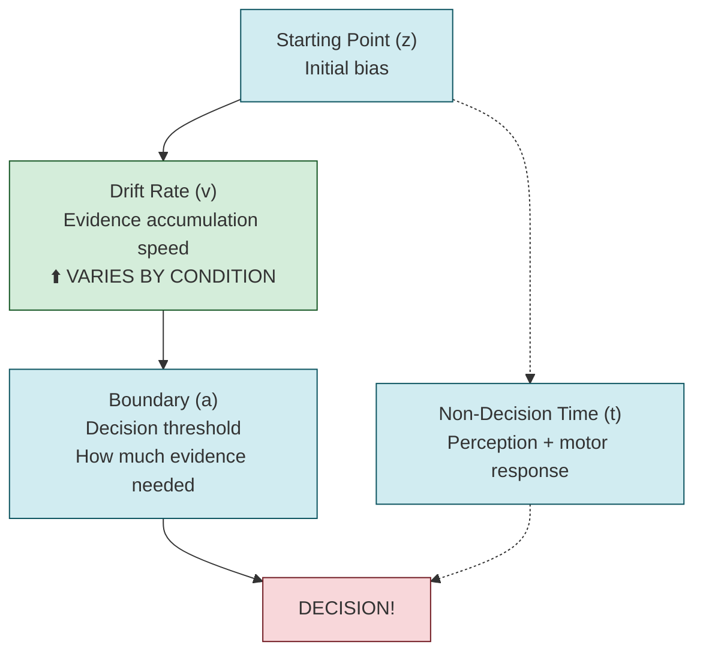
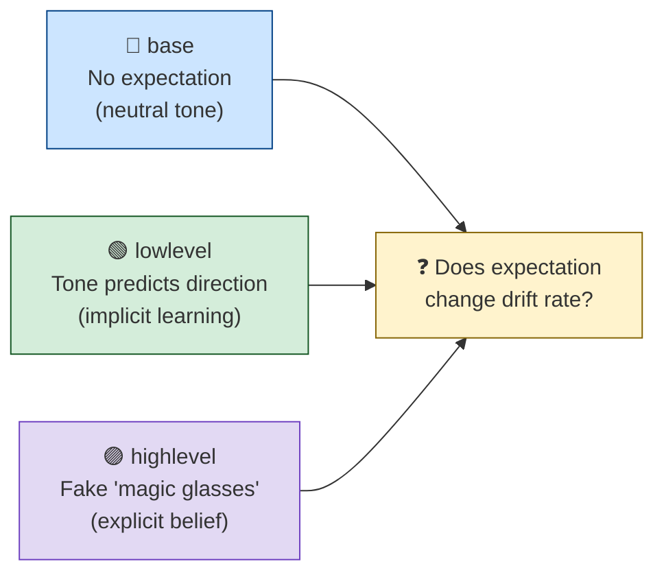
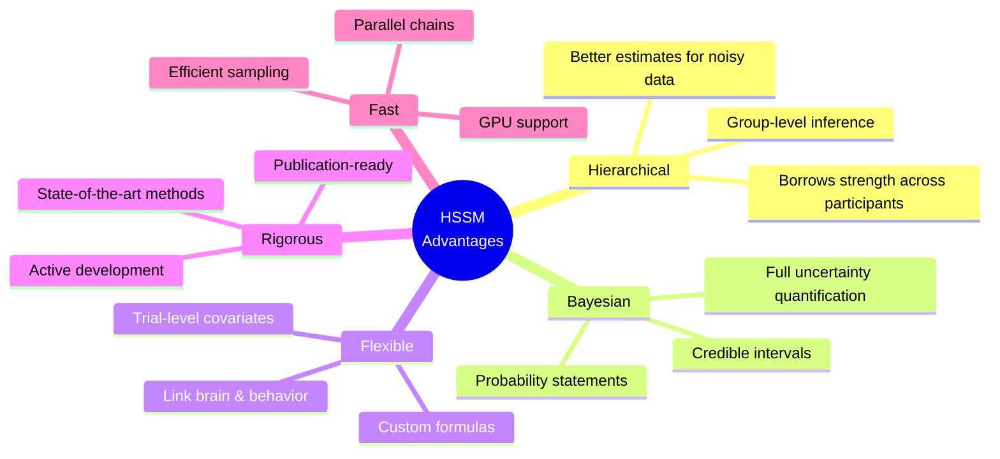
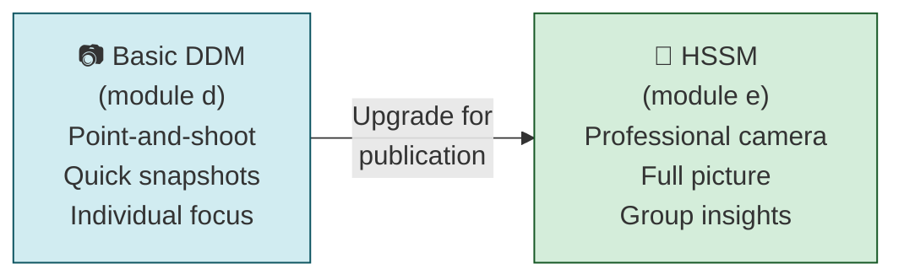

# HSSM Module - Complete Beginner's Guide

## What is HSSM? (The Real Library)

**HSSM = Hierarchical Sequential Sampling Modeling**

It's a modern Python toolbox from Brown University specifically designed to help researchers understand **how people make decisions** by analyzing their reaction times and choices. It's the state-of-the-art tool for fitting drift diffusion models (DDMs) to behavioral data.

**Official site:** https://lnccbrown.github.io/HSSM/

---

## The Core Concept: Sequential Sampling Models

### The Decision-Making Process (Simple Analogy)

Imagine you're a detective gathering clues to solve a case:

```
"It's the butler!" ← DECISION THRESHOLD (enough evidence!)
    ↑ ↑ ↑ ↑ ↑
    clue... clue... clue... (evidence accumulates)
    ↓ ↓ ↓ ↓ ↓
"It's the gardener!" ← DECISION THRESHOLD
```

Your brain doesn't instantly decide—it **accumulates evidence** (like collecting clues) until you have enough confidence to commit to an answer. This is what DDM models.

**Key insight:** People don't make instant decisions. They gather information over time, and HSSM helps us measure:
- How fast they gather evidence (drift rate)
- How much evidence they need before deciding (boundary)
- Whether they start biased toward one answer (starting point)

---

## Why HSSM is Special (vs. Basic DDM)

### The Problem with Traditional DDM

If you test 30 people in an experiment and fit a DDM to each person separately:
- You get 30 independent models
- No connection between people
- Noisy data from one person can't be helped by others
- Hard to test group-level effects (e.g., "Does condition X affect everyone?")

### HSSM's Solution: Hierarchical Bayesian Modeling



**The magic:** 
- Everyone's data helps estimate everyone else's parameters
- If Person 2 has noisy data, the model "borrows strength" from the group
- You can test hypotheses about the whole group, not just individuals
- This is called **partial pooling** or **hierarchical modeling**

---

## What Makes HSSM Powerful?

### 1. **Trial-by-Trial Covariate Analysis**
You can test how things that change from trial to trial affect decision-making:
- Brain activity (EEG theta power)
- Attention level
- Experimental conditions
- Previous trial outcomes

**Example:** "Does higher theta brain activity make people accumulate evidence faster?"

### 2. **Regression Formula Syntax** (User-Friendly)
Instead of complex code, you write simple formulas like in R:

```python
"v ~ 1 + theta + (1|participant)"
```

Translation: "Drift rate depends on a baseline + theta activity + random adjustments per person"

### 3. **Bayesian Uncertainty Estimates**
Instead of: "drift rate = 2.5"
You get: "drift rate = 2.5 ± 0.3 (95% credible interval: 1.9 to 3.1)"

**Why this matters:** You can say "There's an 85% probability that condition X increases drift rate" — something traditional statistics can't do.

### 4. **Built on Robust Tools**
- **PyMC**: Industry-standard Bayesian inference
- **JAX**: GPU acceleration for speed
- **ArviZ**: Beautiful diagnostic plots
- **Bambi**: Regression formula parsing

---

## How HSSM Works in THIS Pipeline

### The Pipeline Context

This EEG pipeline has TWO behavioral analysis modules:



**Module `d` (d_BehavAnalysis_module.py):**
- Fits basic DDM to each person individually
- Fast, simple, good for exploration
- **Runs by default**

**Module `e` (e_HSSM_module.py):**
- Fits hierarchical Bayesian DDM to the whole group
- Slower, more powerful, publication-ready
- **Optional** (off by default: `"compute_hssm": false`)

### Step-by-Step: What Module `e` Does



#### Step 1: Prerequisites
Module `d` must run first to create:
```
data/BIDShierPriors/derivatives/BIDSprocessed/results/groupBehavioral/
    behavioraldata_hierprior.csv  ← All subjects' trial data
```

#### Step 2: Data Preparation
```python
def prep_hssm_data(df, cond_col, conditions):
    # Remove RT outliers
    df = df[~df['rt_flag']]
    # Keep only positive RTs
    df = df[df['rt'] > 0]
    # Recode responses for HSSM:
    #   1 = upper boundary (prior-congruent choice)
    #  -1 = lower boundary (prior-incongruent choice)
    df['response'] = df['response_prior'].map({1: 1, 0: -1})
    return df
```

#### Step 3: Model Specification
```python
model = hssm.HSSM(
    data=df_hssm,
    model="ddm",  # Drift Diffusion Model
    include=[{
        "name": "v",  # Drift rate parameter
        "formula": "v ~ 1 + exp + (1|participant)",  # THE KEY LINE!
    }],
    prior_settings="safe",      # Conservative priors
    link_settings="log_logit",  # Parameter transformations
)
```

**That formula decoded:**
- `v ~` = "drift rate (evidence accumulation speed) depends on..."
- `1` = "a baseline intercept"
- `+ exp` = "the experimental condition (base/lowlevel/highlevel)"
- `+ (1|participant)` = "plus a random intercept for each person"

**Research question:** "Does having an expectation (prior) change how fast people accumulate evidence, accounting for individual differences?"

#### Step 4: Bayesian Sampling (The Slow Part)
```python
model.sample(
    sampler='mcmc',        # or 'nuts_numpyro' for GPU speed
    draws=1000,            # 1000 posterior samples
    tune=1000,             # 1000 warmup samples (discarded)
    chains=2,              # 2 independent chains
    cores=2,               # Parallel processing
    target_accept=0.9,     # High acceptance rate for accuracy
)
```

**What's happening:**
- **MCMC (Markov Chain Monte Carlo)**: A clever algorithm that explores the space of plausible parameter values
- **Chains**: Like sending 2 independent search parties to map terrain—if they agree, you trust the map
- **Why it's slow**: Fitting ~30 people × 3 conditions × ~1000 trials simultaneously (10-30 minutes)

#### Step 5: Outputs
```
results/groupBehavioral/
    hssm_posterior_summary.csv  ← Parameter estimates with uncertainty
    hssm_trace.png              ← Diagnostic plots (did sampling work?)
```

**Example output:**
```
Parameter    Mean    SD    HDI_2.5%  HDI_97.5%
v_Intercept  2.34   0.12    2.11      2.57
v_exp[lowlevel]   0.45   0.18    0.10      0.80  ← Effect of low-level prior!
v_exp[highlevel]  0.62   0.19    0.25      0.99  ← Effect of high-level prior!
```

Translation: "High-level priors increase drift rate by ~0.62 units (95% credible interval: 0.25-0.99), meaning expectations make people accumulate evidence faster."

---

## Configuration in `inputs.json`

```json
"hssm": {
    "model_type": "ddm",              // Drift diffusion model
    "sampler": "mcmc",                // 'mcmc' or 'nuts_numpyro' (GPU)
    "draws": 1000,                    // Posterior samples
    "tune": 1000,                     // Warmup samples
    "chains": 2,                      // Independent chains
    "cores": 2,                       // CPU cores
    "target_accept": 0.9,             // Acceptance rate (higher = more accurate)
    "prior_settings": "safe",         // Conservative priors
    "link_settings": "log_logit",     // Parameter transformations
    "formula_v": "v ~ 1 + exp + (1|participant)"  // THE RESEARCH QUESTION!
}
```

**To enable HSSM:**
```json
"compute_hssm": false  →  "compute_hssm": true
```

---

## What Parameters Does HSSM Estimate?

### The DDM Parameters (What They Mean)



| Parameter | Symbol | Plain Meaning | In This Study |
|-----------|--------|---------------|---------------|
| **Drift rate** | `v` | How fast evidence accumulates | **Varies by condition** (base/lowlevel/highlevel) |
| **Boundary** | `a` | How much evidence needed to decide | Fixed (group-level prior) |
| **Starting point** | `z` | Initial bias before seeing evidence | Fixed (group-level prior) |
| **Non-decision time** | `t` | Perception + motor response time | Fixed (group-level prior) |

**Why only drift varies?** The research question is specifically about whether expectations affect evidence accumulation speed, not caution or bias.

---

## When to Use HSSM vs. Basic DDM

### Use HSSM (Module `e`) When:
✅ Writing a research paper (need rigorous stats)  
✅ Testing group-level effects ("Does condition X affect parameter Y?")  
✅ You have multiple subjects (hierarchical structure shines)  
✅ You want uncertainty estimates (Bayesian credible intervals)  
✅ You need to account for individual differences properly  

### Use Basic DDM (Module `d`) When:
✅ Exploring individual differences  
✅ Need quick results for quality checks  
✅ Preliminary analysis  
✅ Sanity checking data  

---

## The Research Question This Answers

**Experiment setup:** People see moving dots and judge direction. Sometimes they get **expectations** (priors) about which way dots will move:



- **base**: No expectation (neutral)
- **lowlevel**: Tone secretly predicts direction
- **highlevel**: Fake "magic glasses" they believe help

**HSSM asks:**
> "Does having an expectation change how fast your brain accumulates evidence (drift rate)? And is this effect consistent across people?"

**Possible findings:**
- "High-level priors increase drift rate by 0.62 units (95% CI: 0.25-0.99, p(effect>0)=0.98)"
- Translation: Expectations make people process evidence ~25% faster, and we're 98% confident this effect is real

---

## How to Run It

### Prerequisites
1. Install HSSM: `pip install hssm`
2. Run module `d` first: `python d_BehavAnalysis_module.py inputs.json`

### Enable and Run
1. Edit `inputs.json`: `"compute_hssm": true`
2. Run: `python e_HSSM_module.py inputs.json`
3. Wait 10-30 minutes (it's doing serious Bayesian inference!)
4. Check outputs in `results/groupBehavioral/`

---

## Key Advantages of HSSM (Summary)



1. **Hierarchical = Better Estimates**: Borrows strength across participants
2. **Bayesian = Full Uncertainty**: Get probability distributions, not just point estimates
3. **Flexible Formulas**: Test complex hypotheses with simple syntax
4. **Trial-Level Covariates**: Link brain activity to decision parameters
5. **Publication-Ready**: Rigorous statistics journals expect
6. **GPU Support**: Fast computation on large datasets
7. **Active Development**: Cutting-edge methods from Brown University

---

## The Bottom Line

**HSSM is like upgrading from a regular camera to a professional camera with multiple lenses:**



- **Basic DDM (module d)**: Point-and-shoot camera—quick snapshots of each person
- **HSSM (module e)**: Professional camera—captures the full picture with depth, context, and precision

Both are useful, but HSSM gives you the statistical rigor and group-level insights needed for scientific publications.

**In this pipeline:** HSSM tests whether expectations (priors) change how people make perceptual decisions, using state-of-the-art hierarchical Bayesian modeling that accounts for individual differences while estimating group effects.

---

## Additional Resources

- **Official Documentation**: https://lnccbrown.github.io/HSSM/
- **PyMC Documentation**: https://www.pymc.io/
- **ArviZ (Diagnostics)**: https://python.arviz.org/
- **Original DDM Paper**: Ratcliff & McKoon (2008) - "The Diffusion Decision Model"
- **Hierarchical Modeling**: Gelman & Hill (2006) - "Data Analysis Using Regression and Multilevel/Hierarchical Models"
