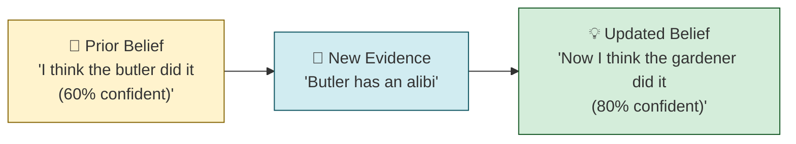
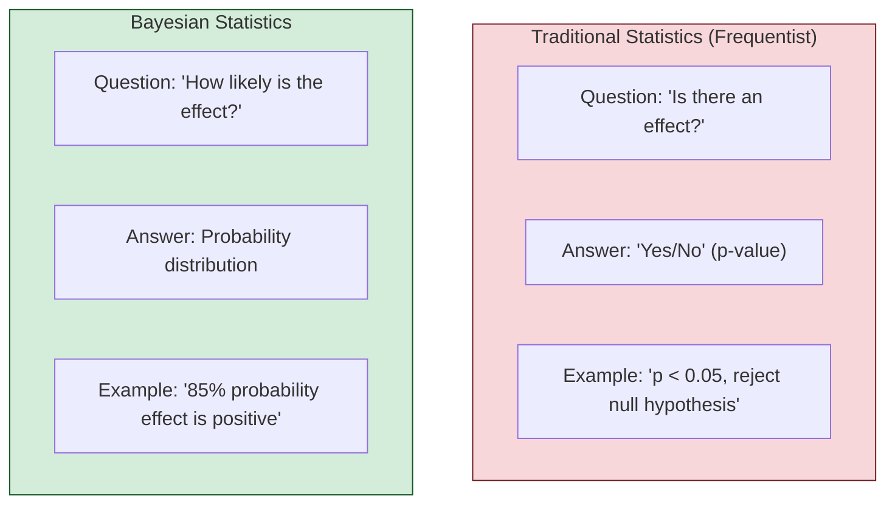
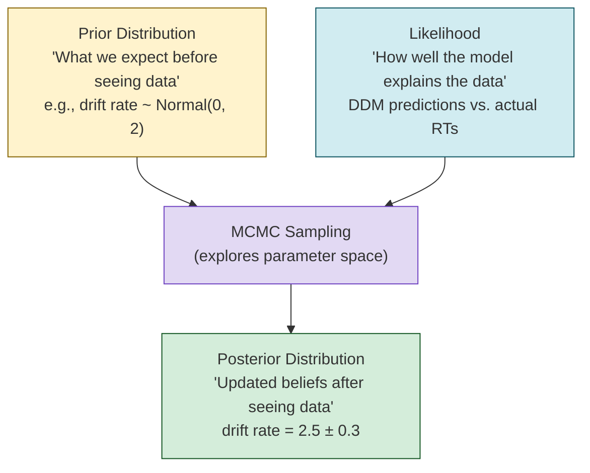
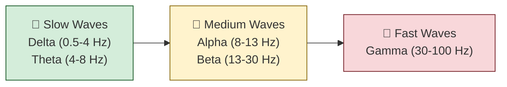
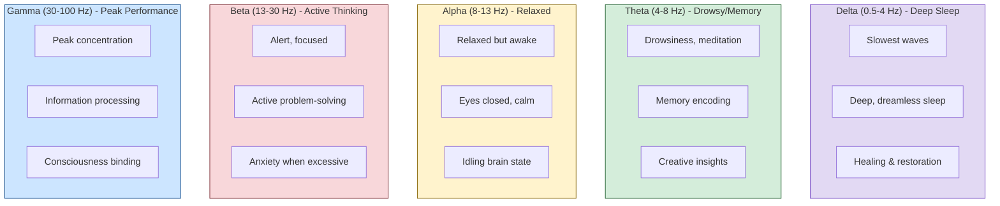
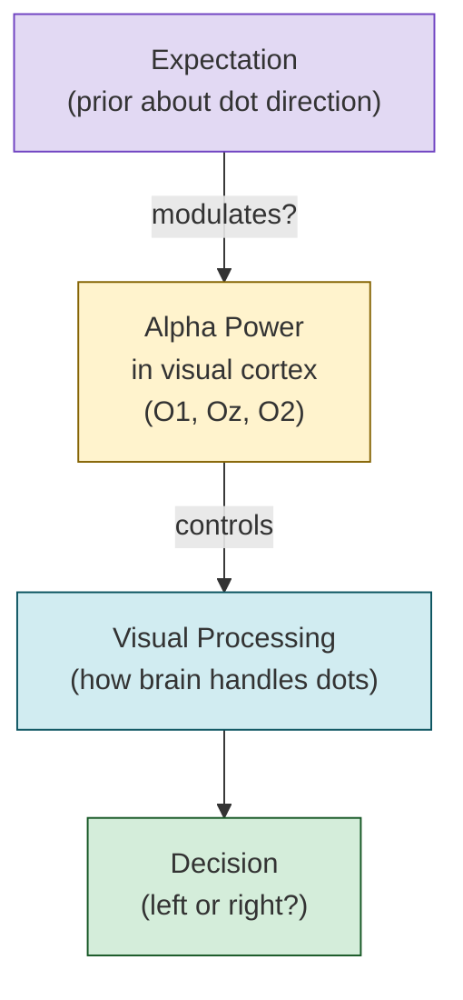
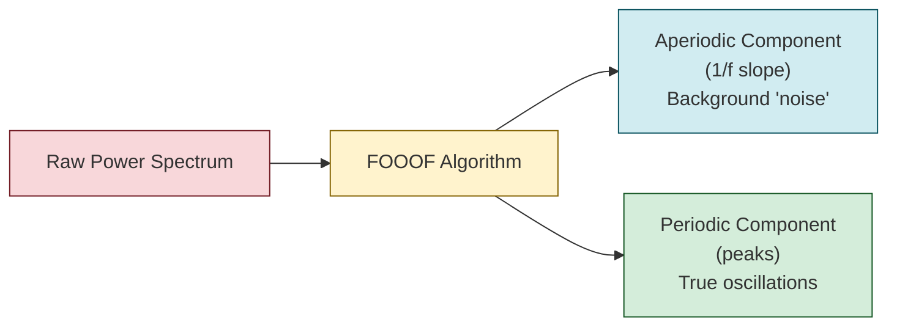
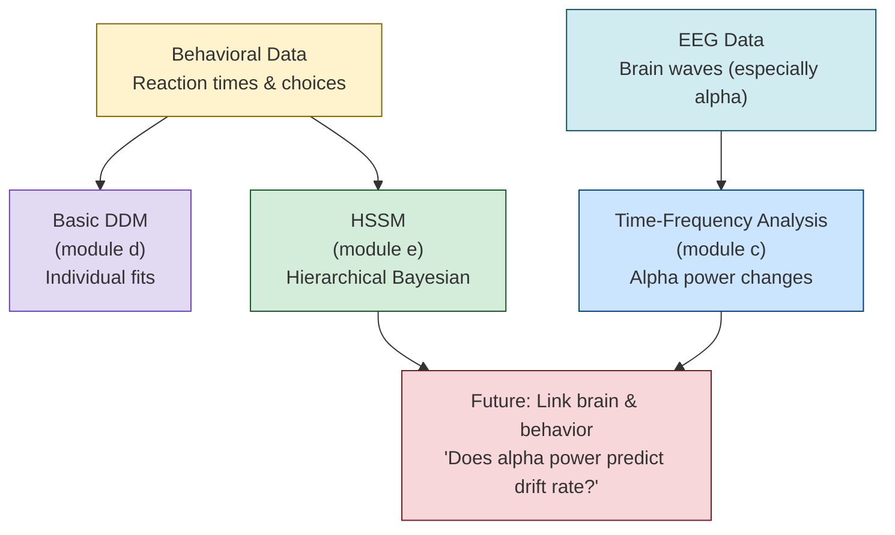

# Bayesian Statistics & Brain Waves - Beginner's Guide

## Part 1: What is Bayesian Statistics?

### The Simple Explanation

**Bayesian statistics** is a way of thinking about probability that updates beliefs as you get new evidence. It's named after Thomas Bayes, an 18th-century mathematician.

### The Detective Analogy 🔍

Imagine you're a detective investigating a crime:



**Bayesian thinking:**
1. **Start with a prior belief** (what you think before seeing data)
2. **Collect evidence** (your data/observations)
3. **Update to a posterior belief** (what you think after seeing data)

### Bayesian vs. Traditional (Frequentist) Statistics



| Aspect | Traditional (Frequentist) | Bayesian |
|--------|---------------------------|----------|
| **Question** | "Is there an effect?" | "How big is the effect, and how certain are we?" |
| **Answer** | Yes/No (p-value) | Probability distribution |
| **Interpretation** | "If no effect exists, we'd see data this extreme 5% of the time" | "There's an 85% probability the effect is positive" |
| **Uncertainty** | Confidence intervals (tricky to interpret) | Credible intervals (intuitive) |
| **Prior knowledge** | Ignored | Incorporated explicitly |

### Why Bayesian is Powerful for HSSM

**Example scenario:** You're testing if expectations affect decision-making.

**Traditional approach:**
- "p = 0.03, so there's a significant effect"
- But what does that *mean*? How big is the effect? How certain are we?

**Bayesian approach (HSSM):**
- "Drift rate increases by 0.62 units (95% credible interval: 0.25 to 0.99)"
- "There's a 98% probability the effect is positive"
- **You can directly say:** "We're 98% confident expectations make people faster"

### The Math (Simplified)

**Bayes' Theorem:**
```
Posterior = (Likelihood × Prior) / Evidence

P(hypothesis|data) = P(data|hypothesis) × P(hypothesis) / P(data)
```

**In plain English:**
```
What you believe after seeing data = 
    (How well the hypothesis explains the data × What you believed before) 
    / How likely the data is overall
```

### Key Bayesian Concepts in HSSM



1. **Prior**: Your starting belief about parameters (e.g., "drift rate is probably between -5 and 5")
2. **Likelihood**: How well different parameter values explain your data
3. **Posterior**: Your updated belief after combining prior + data
4. **MCMC**: The algorithm that explores the posterior (like sending search parties to map a mountain)

### Why HSSM Uses Bayesian Methods

✅ **Handles uncertainty naturally**: Get full probability distributions, not just point estimates  
✅ **Incorporates prior knowledge**: Can use results from previous studies  
✅ **Works with complex models**: Hierarchical models are easier in Bayesian framework  
✅ **Intuitive interpretation**: "85% probability" is easier to understand than p-values  
✅ **Better for small samples**: Borrows strength across participants  

---

## Part 2: Brain Waves (EEG Oscillations)

### What Are Brain Waves?

Your brain's neurons fire in rhythmic patterns, creating **oscillations** (waves) at different frequencies. EEG measures these as voltage changes on your scalp.

Think of it like **different instruments in an orchestra**—each frequency band is like a different section playing at its own tempo.



### The Main Brain Wave Types



### Detailed Breakdown

#### 1. **Delta Waves (0.5-4 Hz)** 💤
- **Frequency**: 0.5-4 cycles per second (very slow)
- **When**: Deep, dreamless sleep (Stage 3-4 NREM)
- **Function**: 
  - Physical healing and restoration
  - Immune system boost
  - Growth hormone release
- **Analogy**: The bass drum—slow, deep, foundational
- **In this pipeline**: Usually filtered out (too slow for cognitive tasks)

#### 2. **Theta Waves (4-8 Hz)** 🌙
- **Frequency**: 4-8 cycles per second
- **When**: 
  - Drowsiness, light sleep
  - Deep meditation
  - Daydreaming
- **Function**:
  - **Memory consolidation** (moving info from short-term to long-term)
  - **Creative insights** ("aha!" moments)
  - **Emotional processing**
- **Analogy**: The cello—smooth, flowing, introspective
- **In this pipeline**: 
  - Filtered out in preprocessing (below 0.1 Hz cutoff removes very slow drifts)
  - But could be analyzed with TFR if studying memory/attention
- **Research link**: Theta power increases during memory encoding and retrieval

#### 3. **Alpha Waves (8-13 Hz)** 😌
- **Frequency**: 8-13 cycles per second
- **When**:
  - Relaxed but awake
  - Eyes closed, calm
  - "Idling" brain state
- **Function**:
  - **Inhibition of irrelevant information** (filtering out distractions)
  - **Sensory gating** (controlling what gets processed)
  - **Attention regulation**
- **Analogy**: The rhythm guitar—steady, background, sets the pace
- **In this pipeline**: 
  - **PRIMARY FOCUS** of analysis! (`alpha_freq_range: [7, 14]`)
  - Measured in occipital electrodes (O1, Oz, O2) over visual cortex
  - **Key hypothesis**: Alpha power changes when people have expectations
- **Research link**: 
  - **Alpha suppression** = active processing (less alpha = more engaged)
  - **Alpha enhancement** = inhibition (more alpha = suppressing irrelevant info)
  - In this study: Does having a prior expectation change alpha power?

#### 4. **Beta Waves (13-30 Hz)** 🧠
- **Frequency**: 13-30 cycles per second
- **When**:
  - Alert, focused attention
  - Active thinking and problem-solving
  - Normal waking consciousness
- **Function**:
  - **Active concentration**
  - **Motor control** (planning and executing movements)
  - **Anxiety** when excessive
- **Analogy**: The lead guitar—active, prominent, driving the action
- **In this pipeline**: Included in analysis (up to 40 Hz cutoff)
- **Research link**: Beta increases during decision-making and motor preparation

#### 5. **Gamma Waves (30-100 Hz)** ⚡
- **Frequency**: 30-100+ cycles per second (very fast)
- **When**:
  - Peak concentration and focus
  - Information processing
  - Moments of insight
- **Function**:
  - **Binding** different brain regions together (consciousness)
  - **High-level information processing**
  - **Perception and awareness**
- **Analogy**: The cymbals—fast, sharp, punctuating key moments
- **In this pipeline**: Partially included (up to 40 Hz), but gamma is typically 30-100 Hz
- **Research link**: Gamma synchronization links perception to action

### Brain Wave Summary Table

| Wave | Frequency | Mental State | Function | In This Pipeline |
|------|-----------|--------------|----------|------------------|
| **Delta** | 0.5-4 Hz | Deep sleep | Healing, restoration | Filtered out |
| **Theta** | 4-8 Hz | Drowsy, meditative | Memory, creativity | Filtered out (but could analyze) |
| **Alpha** | 8-13 Hz | Relaxed, calm | Attention, inhibition | **PRIMARY FOCUS** |
| **Beta** | 13-30 Hz | Alert, focused | Active thinking | Analyzed |
| **Gamma** | 30-100 Hz | Peak focus | Information binding | Partially analyzed (up to 40 Hz) |

### Why Alpha Waves Matter in This Study



**The hypothesis:**
1. When you **expect** to see leftward motion (prior), your brain might:
   - **Suppress alpha** (less inhibition = more processing of expected direction)
   - **Enhance alpha** (more inhibition = filtering out unexpected direction)
2. This alpha modulation could explain why expectations bias perception

**What the pipeline measures:**
- **Relative alpha power** (alpha as % of total power)
- **Total alpha power** (absolute strength)
- **Center frequency** (is alpha at 9 Hz or 11 Hz?)
- **Peak width** (narrow peak = strong rhythm, broad = weak)

### FOOOF and Brain Waves

The pipeline uses **FOOOF (Fitting Oscillations & One-Over-F)** to separate:



**Why this matters:**
- **Aperiodic (1/f) component**: General brain excitability (not a true rhythm)
- **Periodic (peaks)**: True oscillations like alpha
- **Problem**: Traditional analysis mixes them together
- **Solution**: FOOOF separates them, giving cleaner alpha measurements

---

## How This All Connects to HSSM



**The full picture:**
1. **Behavioral analysis** (DDM/HSSM): How do expectations affect decision-making?
2. **Brain analysis** (TFR/FOOOF): How do expectations affect alpha waves?
3. **Future integration**: Can we use alpha power as a trial-by-trial predictor in HSSM?
   - Formula: `v ~ 1 + exp + alpha_power + (1|participant)`
   - Question: "Does alpha power explain *why* expectations change drift rate?"

---

## Key Takeaways

### Bayesian Statistics
✅ Updates beliefs with evidence (prior → posterior)  
✅ Gives probability distributions, not just yes/no  
✅ Intuitive: "85% probability effect is positive"  
✅ Perfect for hierarchical models like HSSM  
✅ Handles uncertainty naturally  

### Brain Waves
✅ Different frequencies = different mental states  
✅ **Alpha (8-13 Hz)** = attention/inhibition (this study's focus)  
✅ Alpha in visual cortex relates to visual processing  
✅ FOOOF separates true rhythms from background noise  
✅ Can link brain activity to behavior via HSSM  

### Why This Matters for the Pipeline
✅ **HSSM uses Bayesian methods** to model decision-making hierarchically  
✅ **Alpha waves** are the primary EEG measure of interest  
✅ **Future goal**: Link alpha power to DDM parameters using HSSM's trial-level covariates  
✅ This bridges **brain** (EEG) and **behavior** (reaction times) in one unified model  

---

## Additional Resources

### Bayesian Statistics
- **Book**: "Statistical Rethinking" by Richard McElreath (very accessible)
- **Video**: 3Blue1Brown's "Bayes Theorem" on YouTube
- **Interactive**: https://seeing-theory.brown.edu/bayesian-inference/

### Brain Waves
- **Book**: "Rhythms of the Brain" by György Buzsáki
- **Review**: Klimesch (1999) - "EEG alpha and theta oscillations reflect cognitive and memory performance"
- **Tutorial**: Mike X Cohen's "Analyzing Neural Time Series Data" (MATLAB/Python)

### FOOOF
- **Paper**: Donoghue et al. (2020) - "Parameterizing neural power spectra into periodic and aperiodic components"
- **Website**: https://fooof-tools.github.io/fooof/

### HSSM + Brain Waves
- **Paper**: Cavanagh & Frank (2014) - "Frontal theta as a mechanism for cognitive control"
- **Example**: Using theta power to predict DDM parameters trial-by-trial
