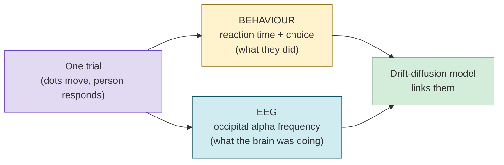
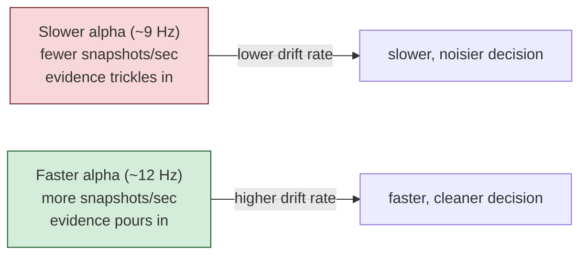
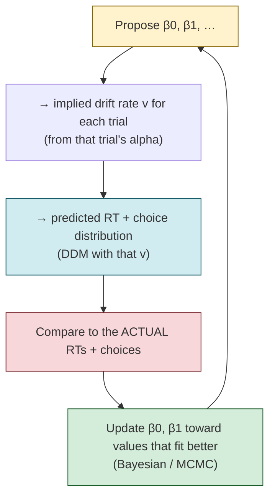
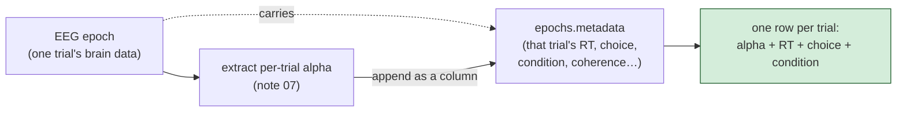

# 11 — How EEG can predict the drift rate (brain + behaviour in one model)

*A conceptual teaching note. Notes 07 and 09 covered the code; this one explains the
**idea**: why a brainwave measured from the scalp can predict how fast someone makes a
decision, and the mechanics of fusing trial-by-trial EEG with behavioural data inside
the drift-diffusion model. Builds on [[04-hssm-explained]], [[05-bayesian-and-brain-waves-explained]],
[[07-trial-alpha-extraction]], and [[09-alpha-in-drift]].*

---

## 1. The big idea: two recordings of the same moment

On every trial we record the same decision from two completely different angles:



Behaviour tells us the **outcome**; EEG tells us the **brain state** that produced it.
The drift-diffusion model (DDM) is the bridge that asks: *did the brain state explain
the outcome?*

---

## 2. The bridge variable: drift rate

The DDM says a decision is **evidence piling up over time** until it hits one of two
boundaries (e.g. "prior-congruent" vs "prior-incongruent"). Four knobs shape it:

| DDM parameter | Plain meaning |
|---|---|
| **drift rate `v`** | how *fast* evidence accumulates — the quality/speed of processing |
| boundary `a` | how much evidence you demand before committing (caution) |
| starting point `z` | a head-start toward one choice (bias) |
| non-decision time `t` | time for stuff that isn't deciding (sensory encoding + pressing the key) |

**Drift rate is the one we tie EEG to**, because it represents *the rate of
information processing* — exactly the thing a brain-state signal should influence.

The catch — and the clever part — is that **drift rate is never directly observed.**
You can't measure it with a stopwatch. The DDM *infers* it from the shape of the
reaction-time distribution and the choices. So when we say "EEG predicts drift rate,"
we're predicting a hidden quantity. Section 4 explains how that's even possible.

---

## 3. Why *this* brain signal should predict it — alpha as a sampling clock

A crucial distinction the other notes blur: there are two different "alpha" measures.

- **Alpha *power*** (how strong the rhythm is) — the classic inhibition/attention
  story from note 05: less alpha power = more cortical engagement.
- **Alpha *frequency*** (how fast the rhythm cycles, ~9–12 Hz) — **this is what we
  used** (the individual alpha frequency, IAF, from note 07).

The mechanistic hypothesis for *frequency* is different and rather beautiful: the
alpha cycle acts like a **shutter** that takes discrete perceptual "snapshots" of the
visual world. A faster alpha rhythm = more snapshots per second = the visual system
samples incoming evidence at a higher rate.



So the prediction is concrete and directional: **higher alpha frequency → higher
drift rate**. That's exactly the sign we found (+0.061; note 09). The "alpha as a
sampling rhythm" idea (Samaha & Postle; Cecere et al.) is the neuroscience behind why
a number extracted from occipital electrodes should forecast decision speed.

---

## 4. How you predict a hidden quantity — regression *on a latent parameter*

Normally regression predicts something you measured (`y ~ x`). Here the target —
drift rate — is latent. The trick is to make drift a **function** of the brain signal
and let the model figure out the function from the behaviour it *can* see:

```
   v(trial) = β0 + β1 · alpha(trial) + (condition terms) + (per-subject offset)
                     ▲
                     └── the EEG→drift slope we want to learn
```

Read that as: *each trial's drift rate is a baseline plus a slope times that trial's
alpha.* The model never sees `v`. It does this loop:



If trials with higher alpha genuinely have faster, sharper RT distributions, the only
way the model can fit the data is to make **β1 positive**. The EEG→drift slope is
*recovered* from behaviour, not measured directly. That's the whole conceptual move.

---

## 5. How the two data streams physically line up

For the model to relate alpha to behaviour **trial by trial**, each trial's brain
number and behaviour number have to sit in the same row. They do, because of how the
data is built:



Because alpha is *appended as a column* to the metadata that already travels with each
epoch, brain and behaviour are aligned **by construction** — same row, same trial. No
key-matching needed (and note 09 shows why a key-merge would actually have corrupted
the alignment). This trial-level table is what feeds the model in section 4.

---

## 6. Why this beats just correlating alpha with reaction time

The tempting shortcut is `corr(alpha, RT)`. It's misleading, because **RT is a sum of
several things**: encoding time + accumulation time + motor time, shaped by drift
*and* caution *and* bias. A correlation with RT can't tell you *which* of those alpha
touched.

Putting alpha specifically on the **drift rate** asks a sharp, falsifiable question —
"does alpha change the *rate of evidence accumulation*, holding caution, bias and motor
time separate?" The DDM decomposes RT into its parts so the neural signal can be tied
to one of them. That specificity is the scientific payoff: not "alpha relates to speed"
but "alpha relates to *processing rate*."

This is also why we checked that alpha isn't secretly proxying motion coherence or RT
(note 09: VIF ≈ 1.01, correlations ≈ 0.03). The drift slope has to be *about alpha*.

---

## 7. Within-subject, and borrowing strength across people

Two more conceptual pieces make the link trustworthy:

- **Each person's alpha is judged against their own baseline.** People differ in
  resting alpha frequency (our three pilot subjects: 9.1 / 10.9 / 11.4 Hz). We center
  alpha *within subject*, so β1 answers "when *this* person's alpha is higher *than
  usual*, is *their* drift faster?" — a within-person question, not "do fast-alpha
  people differ from slow-alpha people." (Note 09 shows these two can even point
  opposite ways.)
- **Hierarchy shares information.** With few trials per person, individual estimates
  are noisy. The hierarchical Bayesian model (note 04) lets subjects inform each
  other's estimates (partial pooling), stabilising the slope. And because it's
  Bayesian, the answer is a *probability* — "84% sure the alpha→drift slope is
  positive" — not a bare yes/no (note 05).

---

## 8. What we actually got (and what it means)

On 3 pilot subjects: the alpha→drift slope is **positive (+0.061), ~84% likely to be
above zero, but not yet credible** (the 94% interval still includes 0). Honestly read:
the bridge is *built and behaving as theory predicts in direction*, but 3 people can't
settle it. The same pipeline on the full ~43-subject dataset is what turns "leaning the
right way" into a real finding. The achievement is the **validated brain→behaviour
bridge**; the finding waits on power. (Full result + checks: note 09.)

---

## Key things to know for the PI quiz

- **What predicts what:** trial-by-trial occipital alpha *frequency* (IAF) predicts the
  *drift rate* (rate of evidence accumulation).
- **Why frequency, not power:** we use alpha as a *sampling clock* — faster alpha =
  more perceptual snapshots/sec = faster accumulation (predicts higher alpha → higher
  drift). Power is the separate inhibition story.
- **How you predict a latent parameter:** make `v` a linear function of alpha; the
  Bayesian fit recovers the slope by matching predicted vs actual RT/choice
  distributions. Drift is never measured directly.
- **How brain & behaviour align:** alpha is appended as a column onto each epoch's
  metadata, so every trial row holds both — aligned by construction, no merge.
- **Why on drift, not on RT:** the DDM separates drift / caution / bias / non-decision
  time, so alpha can be tied to the *rate* specifically — a correlation with raw RT
  can't isolate that.
- **Why within-subject centering:** asks whether *a person's own* alpha fluctuations
  track *their own* decision speed.
